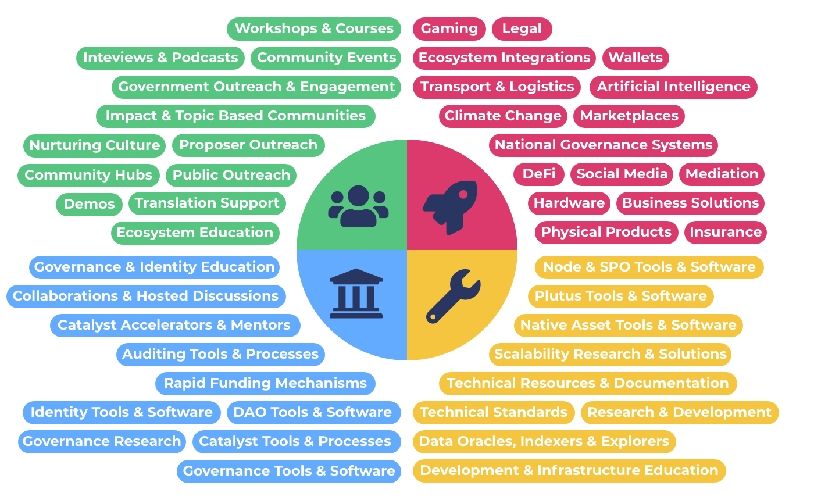

# Overview

There are a number of issues with the current [challenge setting process](challenge-settings/challenge-setting-process.md) used in the Catalyst ecosystem. In this documentation you will find a break down of the current process, analysis on different ways to do categorisation, which attributes are preferable and more effective and suggestions towards an improved funding categorisation approach.

**Objective for funding categorisation**

To ensure that funding categorisation enables opportunity for impactful ideas and innovation to be submitted and considered by the voters in each and every funding round.

### Contents

* ****[**Funding Categories Advantages**](broken-reference) - A list of all of the advantages of using funding categories
* ****[**Funding Categories Analysis**](broken-reference) - Analysing funding categories and how they benefit the Catalyst ecosystem along with addressing any concerns people may have about their usage.
* [**Categorisation Properties**](broken-reference) - Analysis looking at the properties of funding categorisation and how they impact the funding process to determine which ones are more desirable.
* ****[**Categorisation Analysis** ](broken-reference)- Analysis looking at the trade offs between different approaches for doing funding categorisation and also analysis on certain outcomes that are desirable to achieve.
* [**Historical Analysis & Comparisons**](broken-reference) - Exploring historical changes in funding categorisations and comparisons between funding categories and challenge settings.
* [**Community Goals & Objectives**](broken-reference) - Analysis covering the importance of goals and objective and the implications it has on funding categories and challenge settings
* [**Challenge Settings**](broken-reference) - Exploring the current challenge setting process and the issues involved, the issues on how challenge settings are assessed and also a list of the previously selected challenges from previous funding rounds.
