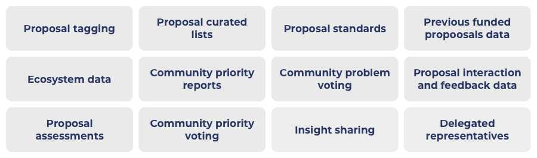

# Approaches For Directing Funding

Broad, inclusive and recurring funding categorisation has the benefit of bringing simplicity to the funding process by helping lower governance and stakeholder effort that is required. A key concern that also needs to be discussed is how the community can effectively direct funding to priority areas in the ecosystem. Those areas could be Africa, DeFi, gaming, social networks or anything else that the community believes is highest priority to receive support and funding.

There are a number of ways that the community can help to direct funding to specific areas in the ecosystem.&#x20;

Challenge setting is the only approach for directing funding that places a requirement on what types of ideas and innovation can be submitted to the funding process. The remainder help to direct funding by improving the information flow to the voters through the use of data, analysis and governance.

Some of these approaches could be achieved likely in the short term (in the next 6 months) and some in the medium term (6 to 18 months). **** Rough approximations for execution have been applied below.

### **Existing approaches**

**Challenge settings**

The community challenge setting process is the current way that funding is being directed to certain areas. The analysis on [specific categories](broad-vs-specific-categorisation.md) helps to highlight the issues around this process and how it can cause restrictive funding with complex budget weighting and justification decisions.

The other main issue for challenge setting as a way to direct funding is it leads to unfair access to opportunities. Some areas will have access to funding allocations and others will not. This stifles innovation as fewer opportunities are able to submit their ideas to the process in different funding rounds. Funding allocation requirements through challenge settings are not required to direct funding to certain areas in the ecosystem and are not effective at supporting an [egalitarian funding](egalitarian-funding-categorisation.md) process.

****

### **Alternative approaches**

**Proposal tagging** (Short term achievable)

Proposal tagging would help with directing funding as the better that proposals can be tagged with the relevant topics and areas the better that voting tools can allow people to filter proposals. The easier this is the more people can ensure they vote on areas that they believe are most important. This is an important area to integrate when using broader categorisation so it's still easy to traverse a larger number of proposals.

**Curated lists** (Short term achievable)

Putting together a curated list helps to bring awareness to voters around certain proposals that are focused on a certain topic, cause or could just potentially meet a certain quality standard. Community representatives or experts with skill, ecosystem or other domain based knowledge could be useful candidates for putting these lists together. Curated lists can be distributed at anytime during the funding process to give people more information on certain proposals which would help to direct funding to proposals where the voter agrees with any proposals that were highlighted.

**Presenting current ecosystem data** (Medium term achievable)

A number of applications and products are being released in the ecosystem. Data could be aggregated to show which areas have products available and show application metrics. This data could be made available in the voting process. Imagine the following scenario, if the voter can see in the voting stage that there are already 10 DEXs that exist in the ecosystem but only 1 stablecoin then this information is valuable in determining which proposals may be more suited to direct funding to. If there are many DEXs then the voter may be looking for better articulation from the proposer on exactly what new innovations they are bringing to the table. In comparison, if there was only 1 stablecoin then the voter may be just looking for another team to be competent to execute the stablecoin product so there is more diversity of options. Having easier access to data will help inform both the voters and any experts in being able to determine what priorities exist for the ecosystem.

****

**Presenting previous funded proposal data** (Medium term achievable)

Funding data is valuable to give voters a better understanding of which teams have already received funding and also which other teams may have received funding within a similar area. Consider a voter was looking at an event proposal to be held in Wyoming. What if the voter is then able to see that 2 other proposals for events in Wyoming recently got funding in the last funding round. This information provides vital context to their own decision making. The voter may decide that events in other locations are more important due to this in attempt to produce more event location diversity. They also are able to check that there isn't any significant overlap in the event agenda if the do choose to vote on the proposal. The more data voters and experts have on funded proposals in similar topic areas the more effectively they can direct votes to areas that they prefer or believe are most beneficial to the ecosystem.

**Community reports** (Medium term achievable)

A community report would involve someone compiling together the data, evidence and reasoning around a given topic, problem or idea to present a report to the community of why something is of a higher priority. This is very similar to the challenge setting process that is currently used however the key difference is it separates the analysis and justification from the funding categorisation. Instead community priority reports could be used to share analysis with the community where people are then able to provide feedback, suggestions about other areas to consider and also offer counter arguments. Reports could be highly valuable as it allows people to focus on looking at a single specific area in depth and make suggestions and recommendations based upon that research. Writing these reports should ideally include some form of community peer review. Impactful reports could also be compensated through the treasury. The aggregation of these types of reports could be very useful for both experts and community members to help them make more informed voting decisions on where to direct funding.

**Proposal interaction and feedback data** (Medium to long term achievable)

Feedback and opinions from the community are currently not incorporated into later stages of the voting process. Community members could ask for further information or evidence to find out more about a proposal or team. Proposal teams that provide more information would have that data become available to the voter and experts at the voting stage. Community members could raise concerns or suggestions that other community members could vote up or down. This type of feedback loop provides valuable data that can be used in the remainder of the governance process to help make better informed decisions on where to direct funding.

****

**Community priority voting** (Medium to long term achievable)

The community could decide to vote on what topics or areas of the ecosystem are the highest priority at an agreed upon frequency such as every month or three months. The options would need to be clear in definition and offer the right granularity so that the data created from the voting is effective at revealing community preferences. This data around community priorities then can be integrated into the governance process to help inform voters and experts on where the community believes funding would be most effectively directed.

**Community problem voting** (Medium to long term achievable)

Cardano will continuously face a different range of problems that could slow the progression or adoption of the ecosystem. Community members could be able to vote on which problems are causing the biggest pain points in the ecosystem at the moment. This data if integrated into the governance process could provide vital insight to the wider community on what problems should be solved. This information can help for improving how many votes are directed to proposals that address these problems.

### Summary&#x20;

* The existing process of using challenge settings to direct funding has a number of issues with how it can cause restrictions for funding to reach certain areas and is also not effective at being egalitarian to all types of ideas.
* There are many alternatives approaches for directing funding that can be integrated to help drive awareness to important ideas and innovations. These alternatives can help achieve the same goal of helping the community have ways to effectively direct funding to priority areas.
* Proposal tagging, curated lists and presenting catalyst funded proposal or existing ecosystem product data are effective short to medium term approaches as they improve information flow  to help voters make well informed decisions in the voting process.
* Proposal interaction, feedback and sentiment data and community priority or problem based voting offer a promising approach for regularly getting distributed and democratic feedback from the community on the problems, proposals and priorities the ecosystem should be considering. The results and data from these community votes can be effectively integrated into the funding governance process so that the community is fully informed.
