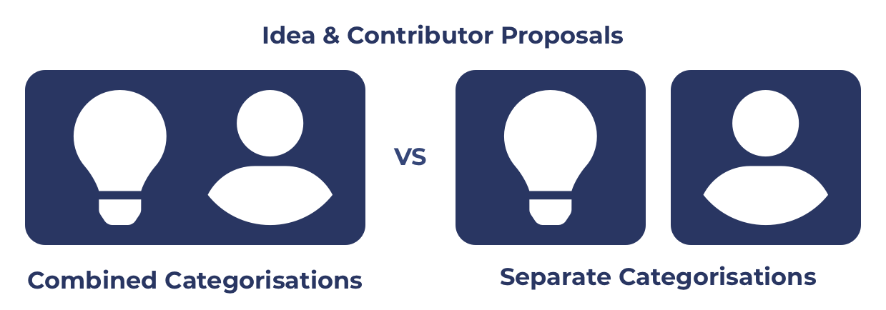

# Combining vs Separating idea and contributor proposals

<figure><figcaption></figcaption></figure>

Consider the potential focus area responsibilities for [Catalyst Contributors](https://docs.catalystcontributors.org/catalyst-contributors/catalyst-contributor/focus-areas) and [Cardano Contributors](https://docs.catalystcontributors.org/cardano-contributors/cardano-contributor/focus-areas).

****

**Factors to consider**

* **Proposal funding frequency** - What frequency is needed for submitting either the idea or contributor based proposals? Is there a reason this frequency will diverge over time?
* **Funding allocation clarity** - What clarity is provided by the approach used in how much funding will be allocated to ideas or contributor initiatives?
* **Proposal structure** - What information is needed for idea and contributor proposals? How do they differ and what implications does that have?
* **Proposal assessment approach** - How do idea or contributor proposals differ in how they are assessed and will this diverge over time?
* **Proposal ranking** - What factors influence how the different proposal types are ranked? When should a good contributor proposal outrank a good idea proposal?
* **Voting flexibility** - How easily can voters allocate funding to a wide range of initiatives at the voting stage?
* **Voting complexity** - Is it easy for voters to understand and compare the options presented to them to make well informed decisions? Is it clear on the implications of their vote in terms of the outcomes that could happen?
* **Insight and data integration** - Can insights and data be easily integrated into the funding process based on the approach being used?
* **Categorisation clarity** - What clarity is there on how the categorisation should be used for proposers and voters?
* **Categorisation budget weighting complexity** - How complex is it to decide on budget weightings due to the approach being used?
* **Catalyst and Cardano ecosystem stability** - Do contributors receive delegated authority and stewardship to support and improve parts of the ecosystem? How important is their role in maintaining stability of the ecosystem?

### **Categorisations that combine idea and contributor proposals**

****

**Advantages**

* **More voting flexibility** - Voters can decide where to allocate funding between both ideas and contributors in a single categorisation. This gives them more flexibility at the voting stage.
* **Lower categorisation budget weighting complexity** - Combining the idea and contributor categorisations reduces the number of categorisations which can help to decrease the complexity of handling budget weighting decisions between categorisations.

**Issues**

* **Diverging proposal funding frequencies** - Electing people to be responsible for supporting the ecosystem could become a high importance role for the ecosystem. This makes it less suitable for constantly changing who is elected. In comparison idea proposals could have a far higher frequency of being selected for funding. Idea proposals aren’t given the same responsibilities to support and maintain the ecosystem like contributors can be. Ideas are also independent from one another and can be executed separately. It is likely that the funding frequency for these proposal types differ as the community takes more ownership over the funding process and the importance of contributors over IOG increases over time.
* **Poor funding allocation clarity** - Combining ideas and contributors into a combined single category makes it less clear on how much funding will actually be directed to contributors who are supporting and improving the ecosystem or ideas. The community can benefit from being able to be explicit on how much funding they believe is necessary for funding contributors.
* **Difficulty handling diverging proposal structures** - Idea and contributor proposal structures will diverge over time as they require different information. This makes it more complex for proposers if multiple proposal type options are being used in single categorisations that represent very different intentions and commitments.
* **Difficulty handling diverging proposal assessment approaches** - As idea and contributor proposals get standardised the way in which they are assessed will likely diverge over time to better find optimum ways to evaluate the different content in each proposal. By combining ideas and contributors in a single categorisation the clarity and complexity of assessing and comparing multiple types of proposal can increase over time.
* **Higher complexity for proposal ranking** - As idea and contributor proposals would be different in the content and attributes added. Due to this the complexity of ranking them increases. When should a good contributor proposal rank higher than a good idea proposal? What are the implications of any the differences in how they are assessed in how that influences the rankings?
* **Higher voting complexity** - Voters have a higher complexity decision to make when combining idea and contributor proposals as they must be able to compare the merits of different intents from the proposals. Complexity is also increased if the number of contributors that are elected could have a significant impact on the level of support and maintenance the ecosystem is going to receive due to the outcome of the vote. The voter would then need to be concerned with ensuring enough contributors are elected in that combined categorisation to support the needs of the ecosystem when comparing with idea proposals.
* **More complex user experience with insights and data** - Insights and data for comparing proposals that proposers, assessors and voters may use would be more difficult if the structure and intent of the proposals are very different. The same insights and attributes relevant to contributors are likely not applicable to idea proposals. Insights and data could still be integrated separately to each proposal type however the quality of the user experience when viewing those proposals collectively in a categorisation becomes more challenging.
* **Lower categorisation clarity** - Mixing idea and contributor proposals would increase complexity in understanding the exact purpose of the categorisation. If the contributors being elected are being given delegated authority over important areas in the ecosystem this increases complexity further as combining multiple proposal types increases the potential adverse outcomes that could occur - such as too many or no contributors at all being elected.
* **Lower Catalyst and Cardano ecosystem stability** - Unless there is any guarantee on a number of contributors that will be elected there is decreased stability as no assurances could be given on having enough people get elected to support and maintain the Catalyst and Cardano ecosystems.

### **Categorisations that keep idea and contributor proposals separated**

****

**Advantages**

* **Handles diverging proposal funding frequency** - If the frequency of funding contributors and ideas diverges over time then keeping these proposal types separate in different categorisations will mean being able to accommodate these changes. Catalyst and Cardano contributors for instance requires a level of knowledge about the ecosystem that would take time to learn. These contributors benefit from being incentivised to stay for a sufficient period of time so that they can deliver value and impact to the ecosystem. The funding frequency of electing contributors to support the Catalyst or Cardano ecosystems therefore may be slower than the frequency that the community wants to fund ideas. If the elected contributors were constantly changing it would be far more difficult to effectively understand the ecosystem, organise themselves, collaborate and deliver impact.
* **High funding allocation clarity** - Having idea and contributor proposals in separate categorisations gives the community more precise clarity on exactly how much funding they are directing to people working full time in the ecosystem compared to what funding is going towards ideas they want to get executed. This produces clearer guarantees for the community in how funding will be used.
* **Handles diverging proposal structures** - Having different proposal standards for idea and contributor proposals will mean they can be better supported by using separate categorisations that would allow for those standards to be applied fully as they are intended. Separate categorisations will mean supporting different requirements for both types of proposal.
* **Handles diverging proposal assessment approaches** - As idea and contributor proposals get standardised the way in which they are assessed will likely diverge over time to better find optimum ways to evaluate the different content in each proposal. Keeping idea and contributor proposals separate in explicit categorisations will mean assessors can focus on assessing the proposals in categorisations that they are most effective at assessing.
* **Easier proposal ranking** - If proposals are the same type with the same content and attributes in a categorisation it will be easier to apply an approach to rank those proposals.
* **Lower voting complexity** - Voters or dReps can focus on one categorisation at a time and then more easily compare the same type of proposal. This scales more easily for dReps as they can specialise in understanding a market of potential contributors or for ideas the current state of the ecosystem. This increases clarity for decisions being made and for voters to make more informed decisions of how best to vote.
* **Simpler insight and data user experience** - Data and insights relevant to contributors can be more easily shown and integrated into the user experience if a categorisation is only focussed on contributor proposals. For instance there could be an insight about the average amount of contributions towards development made by all previous contributors. This insight could be compared against every contributor proposal in the categorisation with a user interface that could better visualise these insights and data against all the proposals submitted.
* **Higher categorisation clarity** - The intent of a separate contributor categorisation is clearer on its own as then all the voter needs to know is that they are just comparing and selecting from potential contributors that want to work in the ecosystem for a certain purpose. The categorisation name can reflect this, such as ‘Catalyst Contributors’. This makes the categorisation very clear on in its intent - to elect contributors that will be helping to support Catalyst. Increased categorisation clarity improves the user experience for voters, proposers and assessors.
* **Higher Catalyst and Cardano ecosystem stability** - If a separate contributor categorisation is used there will be a better guarantee that a certain number of contributors can be elected and paid for based on community decisions around the total budget that the categorisation is allocated. This helps keep the number of contributors elected at a given moment stable and more deliberate based on the communities budget weighting allocation.

****

**Issues**

* **Less voting flexibility** - Voters have less flexibility to direct funds at the voting stage as budget amounts would have already been decided and allocated between the idea or contributor categorisations.
* **Higher categorisation budget weighting complexity** - Separate categorisations for ideas and contributors mean more categorisations are needed. This will increase the complexity for determining the budget weightings to apply to each categorisation.

### **Summary**

* **Diverging funding frequencies** - The more important that funding full time contributors become to support and maintain the ecosystem the more likely it is for the need for longer term incentives so people have continuity to work in the ecosystem. Idea based proposals on the other hand are independent from one another and benefit from faster support from the community to take action on good ideas. Diverging requirements for idea and contributor proposals means the community will benefit from using separated categorisations to support these differences.
* **Diverging standards and processes** - How idea and contributor proposals are created, verified, assessed and ranked will likely diverge over time as they require a different set of information and surrounding data and context to make informed decisions of which proposals are high quality and what impact they might have. As the approach used for these proposal types diverge the infrastructure and processes that is built around those proposals will benefit from custom solutions best suited to each type.
* **Increasing clarity** - To pass over responsibility from IOG as a central entity to the community there is merit to having the protocol to directly pay for community members to support, maintain and improve the ecosystem as voted on by the community. Keeping idea and contributor proposals separate means they can be highly explicit on the intention and implications of the proposals in the categorisation. Increased clarity on the importance and intent of both these proposal types will make it easier for the community to make better informed voting decisions.
