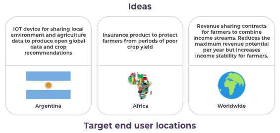
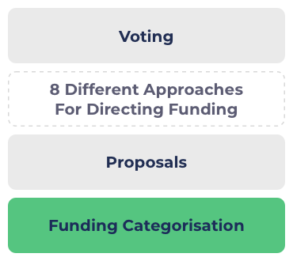

# Egalitarian Funding Categorisation

### What are we concerned about?

Egalitarian funding categorisation for the Catalyst governance process means ensuring that anyone across the world has equal rights and access to the opportunity to submit proposals and equal chance to be funded to execute those ideas. This also means that one type of proposal should not receive any unfair advantage over another.

Consider the following funding categorisations:

**Fund 8 Challenge settings** - From [fund 8 challenge settings](../background/previous-selected-challenges/)

* [Developer Ecosystem](https://cardano.ideascale.com/c/campaigns/26433/about)
* [Open Source Development Ecosystem](https://cardano.ideascale.com/c/campaigns/26434/about)
* [Nation Building Dapps](https://cardano.ideascale.com/c/campaigns/26435/about)
* [Cross-Chain Collaboration](https://cardano.ideascale.com/c/campaigns/26436/about)
* [Cardano scaling solutions](https://cardano.ideascale.com/c/campaigns/26437/about)
* [DApps and Integrations](https://cardano.ideascale.com/c/campaigns/26438/about)
* [Scale-UP Cardano's Community Hubs](https://cardano.ideascale.com/c/campaigns/26439/about)
* [Gamers On - Chained](https://cardano.ideascale.com/c/campaigns/26440/about)
* ... And many others

The combination of all the above challenges and their available budgets determine what proposals are allowed to be submitted in the fund 8 funding round. For the proposal types that can be submitted it also determines the amount of funding that is available based on the challenge budget.

In the above funding categorisation an example of a proposal type with an unfair advantage would be that proposals focused on gaming can submit proposals in both [Gamers On - Chained](https://cardano.ideascale.com/c/campaigns/26440/about) and [DApps and Integrations](https://cardano.ideascale.com/c/campaigns/26438/about). Other types of proposals building applications on Cardano could only use the DApps and integrations challenge. This means that the gaming type proposals have an unfair advantage over other proposal ideas in terms of access to funding. This is one example of many where considerations should be made towards the impact of funding categorisation.&#x20;

Funding categorisation that makes a requirement on which specific ideas have better access to funding is not necessary nor an ideal outcome for effective funding distribution.&#x20;

### **Why is it important?**

**Fairer to all involved**

* **No unfair advantage** - Having egalitarian funding categorisation means no person or proposal should receive an unfair advantage over another person or proposal.
* **Equal access to opportunity** - Egalitarian funding means every person should get the same access to the opportunity and be able to submit proposals for consideration. This does not mean making sure everyone receives funding and also does not mean they should receive an equal amount. Equal access only means ensuring people have the opportunity to request funding.

**Innovation and ideas aren't fully predictable**

* **Innovation in seemingly exhausted areas** - When certain areas of an ecosystem become more heavily developed it can result in the community deciding it is no longer a priority area for funding to be allocated. If funding categorisation is restricted to this area it reduces the opportunity for new ideas to emerge that may offer impactful innovations. No one person or group is able to dictate or predict when and how innovation can arrive. Egalitarian funding categorisation means ensuring that there is room for any idea to present itself so that those ideas at least have the chance to prove why they may be of significance and could benefit the ecosystem.
* **Innovation more nuanced than just problem solving** - Many innovations and ideas can come from different experiences over simply just solving a specific problem. Egalitarian funding means welcoming all ideas so that those that are less obvious in terms of potential impact get the chance to receive feedback and evolve into something potentially highly impactful.

### Funding categorisation examples

The issue for funding categorisation that is not egalitarian happens when the use of one form of categorisation means certain proposals are not able to be included or when one proposal type has an unfair advantage over another related type. This can easily happen with the current funding process using challenge settings as there can be many overlapping categorisations that can cause unfair advantages to one proposal type over another or completely exclude another type. Consider the following examples.

**Example proposals**

Using the above examples we can consider the impact of how having certain funding categorisations would not be egalitarian and could restrict innovation.

**Grow Latin America Challenge** - Proposals focused on solutions for Latin America countries

* This challenge results in excluding the idea for an insurance product to protect farmers from poor crop yield that wants to initially target users in Africa. Funding allocation using this challenge is not egalitarian as it doesn't invite all forms of ideas and limits the number of opportunities that people could submit.
* In this example there may be logical reasons to focus on locations like Africa, for instance for crop yield there could be increased impacts of global warming that mean they want to initially focus on a specific location for their solution. If this proposal team is unable to submit their idea for funding then it:&#x20;
  * Removes the possibility of how the solution could be migrated across to other countries.&#x20;
  * Potentially prevents communication opportunities with other community members on how to collaborate with other countries that could learn from the solution.
  * Gives proposals focused on Latin American countries an unfair advantage in having access to more funding than other countries.

**Insurance Solutions Challenge** - Proposals for new decentralized insurance products

* This challenge has the same issues as mentioned above. It is not egalitarian as it removes the opportunity for the idea about IOT devices for sharing local environment and agriculture data. This idea may not have anywhere else it could be submitted. Or if it can be submitted it could be at a disadvantage compared to proposals focused on insurance solutions that are able to use multiple funding categorisations. If the proposal is unable to fit into another categorisation then the community would have less innovation opportunities options to choose from.

### Egalitarian Catalyst funding&#x20;

Taking into account the above example we can now go into more detail of why the funding categorisation part of the funding process should be egalitarian.

The above image highlights some areas worth considering when thinking about the funding process and effective funding categorisation.

* **Funding Categorisation** - The funding categorisation is at the core of determining what proposals are able to be submitted and what funding is available to them.
* **Proposals** - People write proposals on ideas and innovations they believe would benefit the ecosystem. The funding categorisation to each different area determines what type of proposals can be submitted.
* **Different Approaches For Directing Funding** - There are a number of [approaches for directing funding](approaches-for-directing-funding.md) that the community can use to bring together data, reports and voting on priorities for the ecosystem and community.
* **Voting** - The community has access to the proposal information along with any relevant data, analysis or voting results from any of the different [approaches for directing funding](approaches-for-directing-funding.md). With that information each community member will vote on which proposals they believe should get funding.

**Benefits of egalitarian funding categorisation for the other stages**

* **Proposals** - Unrestrictive funding categorisation means maximising the amount of ideas that the community can submit. These can then be compared, analysed, given feedback to and potentially voted on. If proposals are restricted in anyway the community and voters will get less innovation options to choose from. The community benefits from being able to see all of the possible ideas and options before then becoming more informed and opinionated on which ones they would like to vote on to receive funding.
* **Approaches for directing funding** - The community is able to come together and suggest which areas are of higher priority at anytime. Creating tools and processes for different [approaches for directing funding](approaches-for-directing-funding.md) means the community will have effective ways to communicate each others thoughts on what areas are of highest priority. It is important to note that the community input on priorities is subjective and differs from person to person. Each person will have their own opinions as to what is most important. The directing funding approaches that the community can consider integrating are completely egalitarian and do not make requirements to how funding should be distributed or how people must vote. Instead these approaches improve information flow that helps voters make better voting decisions. These factors result in egalitarian funding categorisation not needed to be the solution on how to direct funding with mandates on who has access to funding.
* **Voting** - Funding categorisation that is egalitarian means voters have the largest number of opportunities to consider as any idea was welcomed for consideration. If information flow improvements are made for how to direct funding then the voter will have both the maximum amount of choices to choose between and also better information to make well informed voting decisions.

**Further reasons the funding categorisation stage should be egalitarian**

* **Fair for all proposers and ideas** - Non restrictive funding categorisation mean all proposals get a fair chance to compete in every funding round.
* **Removes moral issues** - Funding categorisation that focuses on one type of user, location, or product market have the moral issue of justifying why that one focus is important enough that it justifies ideas from a different focus not being allowed the opportunity to submit proposals. This moral complexity is not necessary to effectively determine where funding should be directed.
* **Reduces risk** - Usage of specific funding categorisation puts increased risk on the distribution of funding. This is because innovation for that specific area must present itself at that precise time. This is riskier than allowing a wider range of ideas to compete. It also means rejecting the possibility that at that time there may have been other areas with better innovation ideas.

### Ensuring funding categorisation is egalitarian

**Maintain categorisation that is inclusive and fair**

* A high number of specific categories (currently this is common in the current challenge setting process) are the perfect environment to create restrictive funding categorisation and funding that produces unfair advantages to certain proposal types over another.
* By using broad categorisation that is inclusive of all ideas you maximise the opportunity for all proposal ideas to be presented and then compared based upon their strengths.
* Any community member that has strong opinions on the priorities in the ecosystem is still fully able to vote on those same preferences at the voting stage or create reports and analysis to share with the community and inform voters on which proposals align with that priority. By not adding restrictions at the funding categorisation stage they at least are now able to consider the maximum amount of proposal ideas before making voting decisions.

**Reducing usage of funding categorisation that excludes certain proposals**

The following is a non exhaustive list of funding categorisation that can lead to unfair advantages to certain proposals:

* **Specific product focuses** => Categorisation focusing on one type of product such as 'insurance products' means receiving an unfair funding advantage over other product areas.
* **Demographic focuses** => Certain demographic focuses such as poor, rich, young, old, etc would mean giving an unfair funding advantage over ideas from the excluded demographics.&#x20;
* **Locations** => Using a subset selection of countries or continents against the total available means some countries receive an unfair funding advantage over the ones that are excluded.

**Misconceptions**

* **"The challenge funding allocation is only 2% how could that be unfair?"** - Funding categorisation that results in any unfair proposal advantage or restrictions on being able to submit proposals would simply mean at least 2% of the total fund distribution is not egalitarian. Restrictive funding categorisation is not needed to help direct funding as there are many alternative[ approaches to direct funding](approaches-for-directing-funding.md).
* **"There are twenty diverse funding categories how is that unfair?"** - To determine whether this categorisation is egalitarian you need to look at which ideas can and cannot be submitted and ones that may benefit more from the combination of these categories than others. If a group of ideas are excluded or one proposal type has a greater advantage over another the funding categorisation is not egalitarian. The main issue with a larger number of different categories for funding is the justification and budget weighting complexities that emerge which is outlined in the [funding allocation approaches](broad-vs-specific-categorisation.md). [Broad categories](../funding-categories/overview.md) are the easiest way to ensure that funding categorisation is fair and egalitarian.

### Summary

* **Egalitarian funding categorisation** - Keep the categorisation stage of funding egalitarian by inviting to all forms of ideas and innovation with inclusive categories. Achieve this by using categorisation that is open to all forms of ideas. This is most easily achieved using [broad categories](../funding-categories/overview.md) however more specific and well thought out categories could also achieve the same outcome.
* **Apply priorities, feedback and opinions above the categorisation stage** - The community can have the same conviction over priorities as they do currently using an egalitarian funding categorisation approach. The main difference is that the effort goes into reviewing the proposals submitted with feedback, data, opinions and use of community priority voting to help make well informed voting decisions. This gives innovation the maximum chance to reveal itself and gives everyone a fair chance of being considered even if that idea is considered lower priority to the ecosystem at that time.
