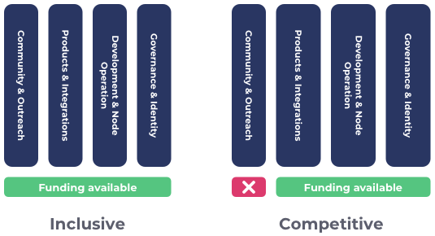

# Inclusive vs Competitive Categorisation

### Funding categorisation: inclusive vs competitive

For determining availability of funding to different areas the categorisation can either go for an inclusive or competitive approach.&#x20;

**Inclusive categorisation**

Inclusive categorisation means allowing all forms of ideas and innovation to be submitted by the community. With this categorisation the voters will have the maximum amount of choices available to them when deciding who to vote for during the funding process. The community will need to determine the budget weighting used for each of the categories.

**Competitive categorisation**

Competitive categorisation means that the categorisations compete with one another to determine which ones will get included in the next funding round. Competitive categorisation can mean excluding some forms of ideas and innovation in favour of providing more funding capacity in certain areas. The community will have to both justify the categorisation and also determine the budget weighting of the categories.

### **Factors to consider**

* **Open or restrictive funding** - How hard or easy is it for all forms of ideas and innovation to request funding due to the categorisation being used?
* **Budget weighting complexity** - What complexity is there for deciding the budget weightings for each categorisation approach? How much effort and how long will it take to get a well informed outcome?
* **Categorisation justification** - How complex is it to provide evidence and data to justify all categorisation selected for a given funding round? How much effort and governance is required?
* **Directing funding** - How effective is the categorisation for directing funding to certain areas that need more funding support?
* **Governance effort** - How much effort is needed to govern the specificity of the categorisation?
* **Stakeholder effort** - How much effort is required to maintain this type of categorisation from the stakeholders involved in the funding process?
* **Level of competition** - High competition can be good for selecting the best proposed ideas and innovation from a wider proposal pool but comes at the cost of making it more challenging for smaller teams. Lower competition for categorisation has the benefit of helping spread the competition difficulty that will help smaller teams but comes at the cost of an increased chance of funding innovation that is not as effective due to the lower competition.

### **Inclusive funding categorisation**

**Advantages**

* **Open funding** - All forms of ideas and innovation would be included. This means maximising the amount of options the voter has to choose from when deciding where to allocate funding. Inclusive categorisation helps to ensure funding is more [egalitarian](egalitarian-funding-categorisation.md).
* **No categorisation justification** - No effort is needed to justify the categorisation as all categories that cover all forms of ideas and innovation will be included.
* **Easy to direct funding** - The categorisations would have their own budgets meaning those involved in voting on this can decide where to allocate more or less funding each funding round.
* **Low governance effort** - For inclusive categorisation the only governance required is around the weightings between the categorisation which can be done in a single vote.
* **High competition** - Distributing the funding into categorisation that invites all ideas and innovation means a higher volume of potential proposals can be submitted which helps to increase competition. Being inclusive also means there is more of a limited amount of funding between all of the categories. This further drives funding scarcity and promotes competition.

**Issues**

* **Budget weighting complexity** - By being inclusive of all ideas and innovation means the categorisation would require more complex budget weighting decisions for each of the categories.
* **Moderate stakeholder effort** - Those involved in deciding the categorisation would need to understand any information around reasons to either increase or decrease a categories budget weighting so they can make informed decisions.

****

### **Competitive funding categorisation**

**Advantages**

* **Low to moderate budget weighting complexity** - The budget weighting complexity would often be lower than inclusive competition if categories are competing against each other and the result is a smaller amount of final categories. This assumes the same level of specificity, such as broad categorisation, for when comparing inclusive and competitive categorisation. A smaller amount of categories means the budget weighting complexity should be low to moderate complexity.
* **Easy to direct funding** - Those involved with deciding categorisation can both choose to include certain areas over others and also apply more or less budget weighting to those areas to influence how funding is directed.

**Issues**

* **Restrictive funding** - Only certain categories will be selected meaning it will limit what ideas and innovation can be submitted.
* **Moderate competition** - Having larger categories competing to be included in the funding categorisation can mean increasing the amount of funding in certain areas rather than spreading it across all ideas and innovation. This can mean reducing the competition in the areas that have higher access to capital. It also removes any healthy competition between projects in funding areas that get excluded.
* **Very difficult categorisation justification** - Competitive selection of categorisation requires a lot of effort to provide enough justification as to why one category should be included over another one as the result of this justification means excluding certain funding areas. High amounts of supporting data, analysis and confidence would be required for those voting to make a well informed decision.
* **High governance effort** - There is a need for information around justifying the categories that are included or excluded. There is also governance needed on the budget weighting of the selected categories. Doing these votes simultaneously is more risky as it could lead to undesired outcomes in terms of funding allocation which makes the governance efforts more complex to manage.
* **High stakeholder effort** - Those involved deciding the categorisation must understand both reasons to include or exclude certain categories and also factors around the budget weighting of those categories.

****

### **Summary**

* **Both approaches effective for directing funding** - In either approach the community is able to increase or decrease the amount of funding that is directed towards certain areas. Competitive categorisation however does mean the funding can be more heavily directed with funding as other areas can be excluded.
* **Complex categorisation justification** - The complexity of the justification required for competitive based categorisation is very high and is a big issue worth avoiding. By removing funding for certain areas the community makes a guess ahead of time where the best innovation will come from and leaves no opportunity to be wrong. This is far riskier in terms of funding allocation as it is difficult ahead of time to know what forms of ideas and innovation will show up and which proposals will be the most promising.
* **More governance and stakeholder effort with competitive categorisation** - Competitive categorisation means more effort is required around the justification of excluding or including certain areas for funding. Increased effort is required for supporting the information flow into governance decisions, governing the outcome of decisions and also increases the effort required by those involved in making the decision for every funding round.
* **Inclusive categorisation is less risky and easier to manage** - Inclusive categorisation means not making risky predictions on how innovation should unfold by not trying to dictate how innovation should present itself ahead of time. Instead inclusive categorisation allows all forms of idea and innovation and the main complexity for the community to deal with is the budget weighting between the categorisation. Inclusive categorisation has the large benefit of maximising the amount of options the community has to choose from when deciding where to allocate funding.
