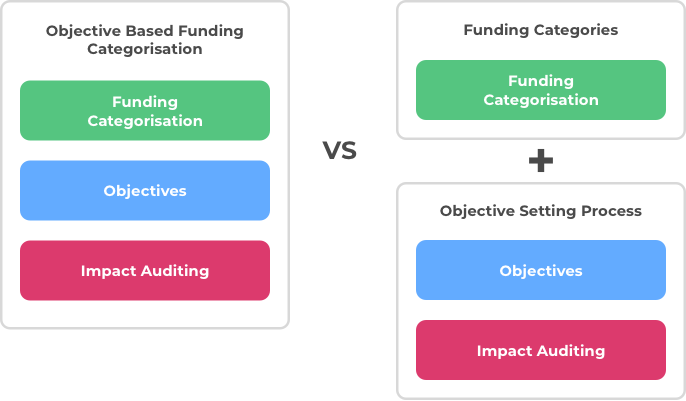

# Objective vs Category Based Funding Categorisation

Should the Catalyst funding process use objective based funding categorisation that combines funding categorisation, [objectives setting](objective-setting.md) and [impact auditing](progress-and-impact-auditing.md)? Or alternatively should it use funding categories and have an [independent objective setting process](independent-objective-setting-process.md)?&#x20;

The [challenge setting process](../../background/challenge-setting-approach.md) used initially in Catalyst is an example of objective based funding categorisation.

The seven [categories](broken-reference) suggested in this documentation are an example of using funding categories that would then benefit from having an [independent objective setting process](independent-objective-setting-process.md).

### Factors to consider

**Categorisation**

What are the implications of the categorisation approach in terms of whether it promotes recurring vs changing, inclusive vs competitive or broad vs specific categorisation?

****

**Objectives**

How are objectives involved with the funding process using that funding categorisation approach?

****

**Auditability**

How is the impact of a funded proposal measured to determine whether it met the objectives that were set?

### Objective based funding categorisation

Objective based funding categorisation means the categorisation is created based upon the objectives set by the community in a single process. This means both the objectives and auditability of proposals are integrated into the funding categorisation. The challenge setting process used in the Catalyst process is an example of objective based funding categorisation.

**Promotes changing, competitive and specific categorisation**

* Competitive - There are a large amount of potential objectives that could exist and be set by the community. These objectives would compete to have access to a fixed amount of funding available in each funding round.
* Changing - Objectives can increase or decrease in priority or could also be completed each funding round. This means objective based categorisation leads to categorisation that is always changing.
* Specific - Many objectives are created to solve certain problems or add value to the ecosystem. This leads to having more specific categorisation to target those objectives. This is not true for all objectives, some can also be broad such as a simple objective of deploying new DApps and integrations on the Cardano blockchain.

**Advantages**

* Easier proposal comparisons - By having categorisations focussed on objectives it makes it easier to compare and decide between proposals that are submitted for one specific objective. This comparison between proposals with the same objective could also be done in category based funding categorisation however as categories can easily be larger in scope it also means voters will need to compare the differences of proposals trying to solve different objectives.

**Issues**

* Inflexible - Funding categorisation that is focussed on objectives is less flexible to sudden changes as the funding categorisation cannot suddenly change midway through a funding round. A new emerging objective during a funding round would have difficulty in supporting relevant proposals if they were not able to be submitted to the categorisations that were available.
* Restrictive & exclusionary - There are potentially hundreds or thousands of potential objectives that could exist. Different values, perspectives and interpretations from the community lead to differences in what those objectives should be and how they could be achieved. The issue with only being able to cater for a number of objectives is it means giving the voter less options to choose from and needing to accept the fact that the proposals which can’t be submitted may be more impactful than the ones being accepted in that funding round. Proposers in an exclusionary funding environment aren’t given the opportunity to present ideas and innovation which could offer a more compelling objective or idea to the voter.
* Increased risks - By making mandates on where funding is available based on objectives it increases the risk of having categorisation where proposals do not turn up to solve that objective. Another bad outcome is having a number of proposals submitted that are of an average to low quality. In these scenarios funding could have been better directed to other higher quality proposals focussed on different objectives.
* Higher complexity - Funding categorisation tied to objective setting means there is a constant need to review ecosystem wide information to create sensible and well informed justifications on which objectives and categorisations to suggest and vote for. The more objective based funding categorisations there are the less funding that can be distributed between them from a fixed available amount. Objective based categorisation can easily lead to high complexities around justification of the categorisations and budget weighting as well as higher efforts for governance and stakeholders to manage the process.

### **Categories based funding categorisation & Independent objective setting process**

Category based funding categorisation is where proposal types are grouped together around a similar topic area (e.g. Governance & Identity or Community & Outreach) or aim to fulfil a certain function (e.g. Nurturing Ideas & Teams). Categories only focus on the categorisation meaning they only determine what proposals can be included in the category and the available budget to those proposal types. Objectives and auditability would be integrated from an [independent objective setting process](independent-objective-setting-process.md) outside of the categorisation process. The objectives and auditability would be incorporated into the funding process separately and proposers would need to identify which objectives they are aiming to support so voters can compare proposals based on their objectives.

**Promotes recurring, inclusive and broad categorisation**

* Recurring - Categories based on topic areas or fulfilling a function can be defined upfront and used in each funding round making them a suitable choice for recurring categorisation. Categories could still change but would only need to when necessary.
* Inclusive - Categories focussed on topic areas and function can more easily be inclusive to all forms of idea and innovation making them suitable for being an inclusive form of funding categorisation.
* Broad - Topic area and function focussed categorisation is well suited to offering broad categorisation that invites multiple proposal type. Categorisation could be made more specific on the types however this comes at an increase cost of complexity for governance and stakeholders.

**Advantages**

* Flexible - Categories are flexible to changing objectives as the categorisation doesn’t specify what must proposals must focus on. This is good for allowing the community to update or add new objectives as they emerge which will help improve the speed in which proposals of higher priority can be identified and receive funding.
* Low complexity - Usage of recurring categories means no justification is needed every funding round to decide which categorisations to include. Instead the only complexity is around the budget weighting between categories.
* Low stakeholder and governance effort - Instead of having effort around justifying categorisations and assessing and voting on them every funding round the community would only need to put effort into the budget weightings. It can also become more efficient over time as using recurring categorisations will produce data around proposal quality and the submission amount in each category. This data can reduce the effort to make well informed decisions on applying suitable budget weightings.
* Less risky - Having categories that allow for a mixture of proposal types with different competing objectives. This makes it less risky for situations where there are no proposals for a given objective or alternatively there is only a number of proposals that are of poor quality.
* Healthy competition and maximum voter options - It is easy for categories to be inclusive of all forms of idea and innovation. This means the voters can be given the maximum amount of choice and also helps create healthy competition between a number of different proposals.

**Issues**

* Low priority proposals - People can suggest proposals that are not useful or impactful. The voter still gets to decide which proposals are impactful or not. To reduce burden on the voter this issue can be solved by using ranking algorithms to highlight the most prioritised proposals at the voting stage as well as other attributes of a proposal that demonstrate they are of a higher quality.

### Summary

* Using categories focussed on focus areas or fulfilling a certain function means categorisation gets the benefits of being [recurring](../recurring-vs-changing-categorisation.md), [inclusive](../inclusive-vs-competitive-categorisation.md) and [broad](../broad-vs-specific-categorisation.md).
* Categories can incorporate objective setting with auditability at the proposal level and achieve the same outcomes as objective based funding categorisation but without all the complexity of allowing categorisation to become changing, competitive and specific.
* An [independent objective setting process](independent-objective-setting-process.md) along with category based funding categorisation offer an effective solution to the current issues faced by objective based funding categorisation such as the [challenge setting process](../../background/challenge-setting-approach.md).
