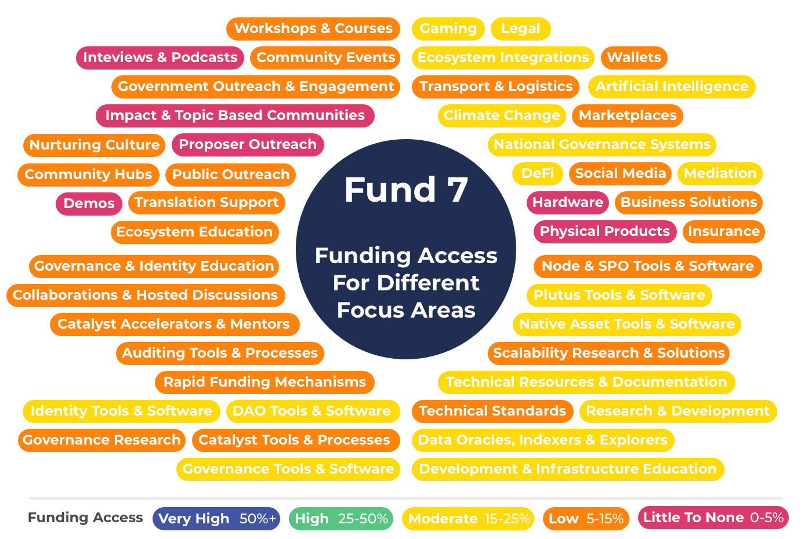

# Proposal Types Funding Access History

To understand the implications of using certain funding categorisation approaches one useful visualisation is for seeing what amount of funding was available to each of the proposal types in each funding round.

**=>** [**Methodology**](methodology.md) - Read the methodology for this analysis to understand how the percentages were derived.

### Proposal type funding access per funding round

****[**Fund 8 ⇒ Read about observations**](fund-8.md)****

****

[**Fund 7 => Read about observations**](fund-7.md)****

**Data**

****[https://docs.google.com/spreadsheets/d/1XzlUhgkzE5NGBLa55wqJlgfm8YES3kJ6t5KgZAggtmE](https://docs.google.com/spreadsheets/d/1XzlUhgkzE5NGBLa55wqJlgfm8YES3kJ6t5KgZAggtmE/edit)

****

**Feedback**

Please provide any feedback to for changes or improvements to the following Telegram group -[https://t.me/catalystfundingcategories](https://t.me/catalystfundingcategories)

### Analysis

**Higher complexity from overlapping categorisations**

There are a number of examples where there are a mix of similar broad categorisations such as [Developer Ecosystem](https://app.ideascale.com/t/UM5UZBraj) and [Open Source Development Ecosystem](https://app.ideascale.com/t/UM5UZBqsx) and also specific categorisations such as [Gamers On - Chained](https://app.ideascale.com/t/UM5UZBqeS) which are a subset of broad categorisations such as [DApps and Integrations](https://app.ideascale.com/t/UM5UZBrBL). This makes the process more complex for proposers as they must determine where to put their proposal to maximise the chance of being funded. Assessors must determine whether proposals should or should not be in certain categorisations and voters in cases will need to look in numerous categorisations to compare similar proposal types. One way of trying to resolve this complexity is to add rules and guidance as to how categorisations should be used in a number of events however this simply just adds extra unnecessary complexity.

**Difficult to easily determine what proposals should be included**

As the challenges are changing each round it became clear there is a constant complexity of working out which proposal types can fit into which categorisations. It helps to highlight the importance of considering the trade offs of using recurring vs changing categorisation.

**Well defined categories make it easier to extract useful statistics**

The categorisations made it more difficult to create accurate percentages that would provide higher confidence as to what areas funding is being distributed towards. This again helped to highlight the benefits of using recurring categorisation. Using well defined categorisations would be effective in making it easier to see exactly what amount of funding is available for each proposal type. This allows the community to track over time to determine both what funding was available to different types of proposal and also what funded was actually distributed to each type. This data would be useful for further informing better budget weighting decisions.

**Current challenge setting approach requires a lot of interpretation**

To give an example of the interpretation that is needed one example could be that the "Cross collaboration" challenge states: "Number of events / workshops / sessions arranged with other communities" as a metric to measure. As hackathons are a form of event, proposers could interpret this as it being included in the categorisation. Another potential interpretation could be that educational resources could be included as well as they help facilitate similar outcomes as workshops. These examples are simple but important to highlight the added complexities of having changing categorisation where it leads to increased confusion when categorisations require more interpretation.
