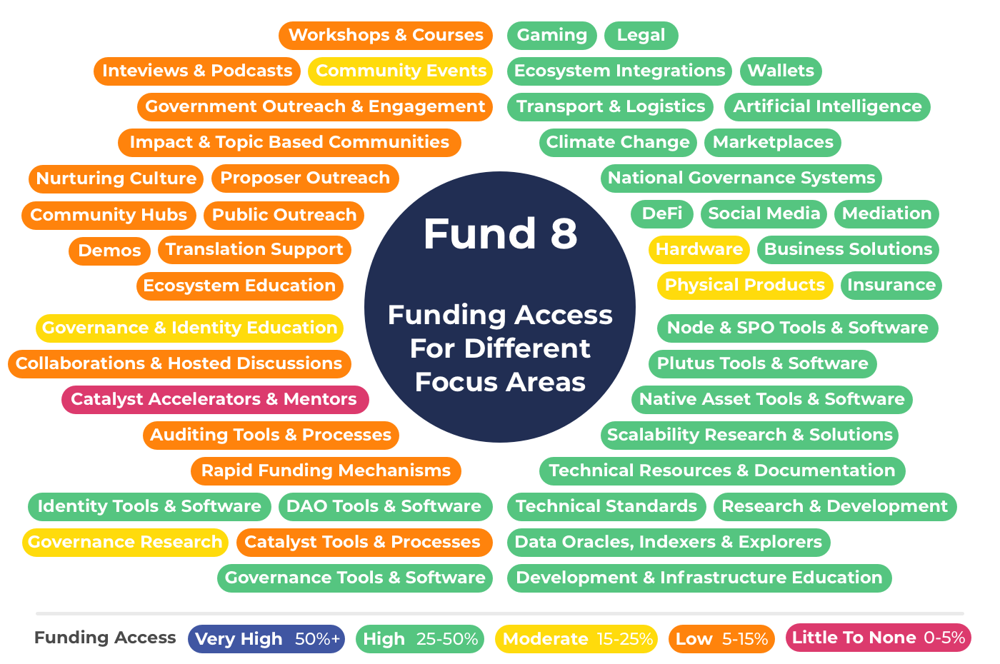

# Fund 8

**Data**

[https://docs.google.com/spreadsheets/d/1XzlUhgkzE5NGBLa55wqJlgfm8YES3kJ6t5KgZAggtmE](https://docs.google.com/spreadsheets/d/1XzlUhgkzE5NGBLa55wqJlgfm8YES3kJ6t5KgZAggtmE/edit)

****

**Feedback**

Please provide any feedback to for changes or improvements to the following Telegram group -[https://t.me/catalystfundingcategories](https://t.me/catalystfundingcategories)

### Observations

**Repeated categorisations**

One issue for fund 8 was the inclusion of a repeated categorisation with a different budget weighting. The issue was raised during the process that this outcome could occur however the repeated categorisation couldn’t be removed after assessment had started. Although this problem can be fixed in the process it does highlight the importance of democratic budget weighting votes to determine the outcome of how much funding is allocated to certain categorisations. Currently challenge settings do not do this as they give unilateral control of this decision to the person or team who submits the challenge setting.

**Similar categorisations**

Similar categorisations are a bigger issue than repeated categorisations which are easy to avoid by just merging the categorisations. Similar categorisations have differences but overlap in what they focus on. An example in this round was [The Great Migration (from Ethereum)](https://app.ideascale.com/t/UM5UZBw7N) and [Cross-Chain Collaboration](https://app.ideascale.com/t/UM5UZBunq) which although have different scopes both include efforts for the migration of Ethereum projects onto Cardano. The intention could be for these to be used very separately however the reality of the result is increased complexity for the proposer needing to interpret how to use each of the categorisations. Another issue with the cross chain related categorisations is they in some instances are a subset of the [Products & Integrations](https://app.ideascale.com/t/UM5UZBunL) which adds further confusion as many of these proposals could be submitted in multiple categorisations.
