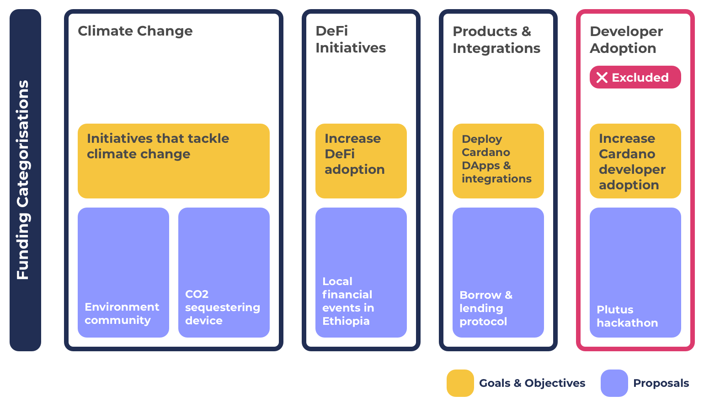

# Goals & Objectives With Challenge Settings

Challenge settings allows for any form of funding categorisation. This means that categorisations can be cover broad to specific proposal type groupings. They could also be goal or objective focussed categorisations.

The flexibility provided by challenge settings results in multiple problems. Challenge settings are not effectively at promoting categorisation that is simple, efficient, flexible and scalable. The cause of these issues are due to the challenge setting process promoting [specific](../categorisation-approaches/broad-vs-specific-categorisations.md), [exclusive](../categorisation-approaches/inclusive-vs-exclusive-categorisations.md) and [changing](../categorisation-approaches/recurring-vs-changing-categorisations.md) categorisation.

**Challenge settings promotes changing, competitive and specific categorisation**

* **Changing** - Objectives can be completed or can increase or decrease in priority each funding round. Objective based categorisation leads to categorisation that is always changing.
* **Exclusive** - There are a large amount of potential goals and objectives that could exist that need to be prioritised by the community. Objectives would need to compete to have access to a fixed amount of funding available meaning many objectives are often excluded.
* **Specific** - Achieving goals by setting specific objectives helps to solve certain problems and add value to the ecosystem. This approach leads to increasing the number of specific categorisations to target those objectives. This is not true for all categorisations, some could just focus on broad goals. One example could be the goal of deploying new DApps and integrations on the Cardano blockchain.

**Advantages**

* **Easier proposal comparisons** - By having categorisations focussed on goals or objectives it makes it easier to compare and decide between proposals that all focus on one specific objective. This comparison between proposals with the same goal or objective could also be done in category based funding categorisation and this would be achieved at the view layer by filtering proposals based on the goal or objectives. The only difference is that funding categories are larger in scope which means voters would also need to compare and decide on proposals that have different goals or objectives.
* **Guaranteed goal or objective funding** - Goal and objective based categorisations create a guarantee that the selected goal or objectives will have funding distributed to proposals aimed at that specific goal or objective. Although this can be a positive outcome there are also numerous negative situations depending on the proposals that get submitted and their quality.

**Issues**

* **Lower flexibility** - Funding categorisations focussed on goals or objectives are less flexible to sudden changes. Funding categorisation cannot suddenly change midway through a funding round. A new emerging goal or objective during a funding round would have difficulty in supporting relevant proposals if they could not have been submitted due to the categorisations available. There is also a risk that an objective is achieved midway through a funding round which is an issue as that funding could have been better reallocated if the funding categorisation was more broad focussed and flexible.
* **More restrictive & exclusionary** - There are potentially hundreds of goals and hundreds or thousands of potential objectives that could exist at a given moment. Different values, perspectives and interpretations from the community lead to differences in what those goals and objectives should be and how they could be achieved. There is a limited amount of funding available in each funding round. Goal and objective based funding categorisation can only cater for a number of those goals or objectives. This results in giving the voter less proposal options to choose from by using exclusionary categorisations. Voters would also need to accept the fact that the proposals which can’t be submitted due to this exclusionary approach may actually be more impactful than the ones being accepted due to the mandates created by the goal or objective categorisations. Proposers in an exclusionary funding environment aren’t given the opportunity to present ideas and innovation which may have offered a more compelling idea or solution to the voter.
* **Increased risk of poor outcomes** - Mandates on where funding is made available based on goals or objectives increases the risks of having categorisation where proposals do not turn up to solve those specific objectives. Another bad outcome is having a number of proposals submitted that are of an average to low quality. Some objectives may even have situations where the solutions are not feasible in the short term. In these scenarios funding could have been better directed to other higher quality proposals focussed on different objectives.
* **Higher complexity** - Funding categorisation tied to goal or objective setting means there is a constant need to review ecosystem wide information to create sensible and well informed justifications on which goal and objective based categorisations to suggest and vote for. The real issue is that these goals and objectives must be attached to a precise budget weighting, the more categorisations that are made the more complex the decision. More categorisations also means less funding distributed between them from a fixed available amount. This massively increases the complexity of determining which categorisations to include and exclude and what budget weightings should be applied to each of the categorisations. Currently challenge settings budget weightings are unilaterally decided on by the challenge team for the entire community! Goal and objective based categorisation mean much more effort for governance and stakeholders is needed to manage the process. Proposing challenge teams must determine a suitable budget weighting, assessors must review every categorisation and voters must read all these categorisations to decide what to include and exclude. This complexity continues to increase as the number of potential categorisations increases.
* **Poor scalability** - Objectives set by the community will be often changing between funding rounds. Forcing objectives into funding categorisations makes it far harder to scale and automate the categorisations as they are less predictable. It becomes more difficult to integrate feedback from the usage of the previous categorisations. Increased manual effort is needed to determine a suitable budget weighting for the categorisation which makes it more difficult to scale effectively.

**Challenge settings and goal setting visualisation**

* **Exclusion of goal based categorisation** - The example above shows an example of an excluded proposal due to the categorisations that are included and excluded. Challenge settings are competitive meaning they lead to exclusive categorisation which makes it easy for goals and objectives along with their relevant proposals to be excluded from funding rounds. This means voters will receive less options to select from. Those excluded proposals could be higher impact than the ones that are included.
* **Difficulty with dynamic changes** - Categorisations where goal or objective setting is a main focus result in a brittle categorisation that is less flexible to dynamic changes in goal or objective priorities. This problems occurs due to the specificity of the categorisation and the mandate it creates on one goal or objective area. This cannot be changed once set during the funding round.
* **Complexity for proposers** - Proposals that match multiple goal or objective focuses have increased complexity on where to place their proposals due to the categorisation overlaps. In the challenge setting approach they must choose a single categorisation to submit a proposal. This may not reflect all the goals and objectives they are looking to help with.
* **Complexity for budget weighting** - As the number of goal or objective based categorisations increase the complexity for what budget weighting to apply increases. It would be difficult to apply an accurate and suitable budget weighting to a large number of goal or objective based categorisations. This categorisation approach also attempts to be overly predictive of how innovation should unfold. This approach is not an accurate representation of the spontaneous nature of innovation and how it can occur in practice.
