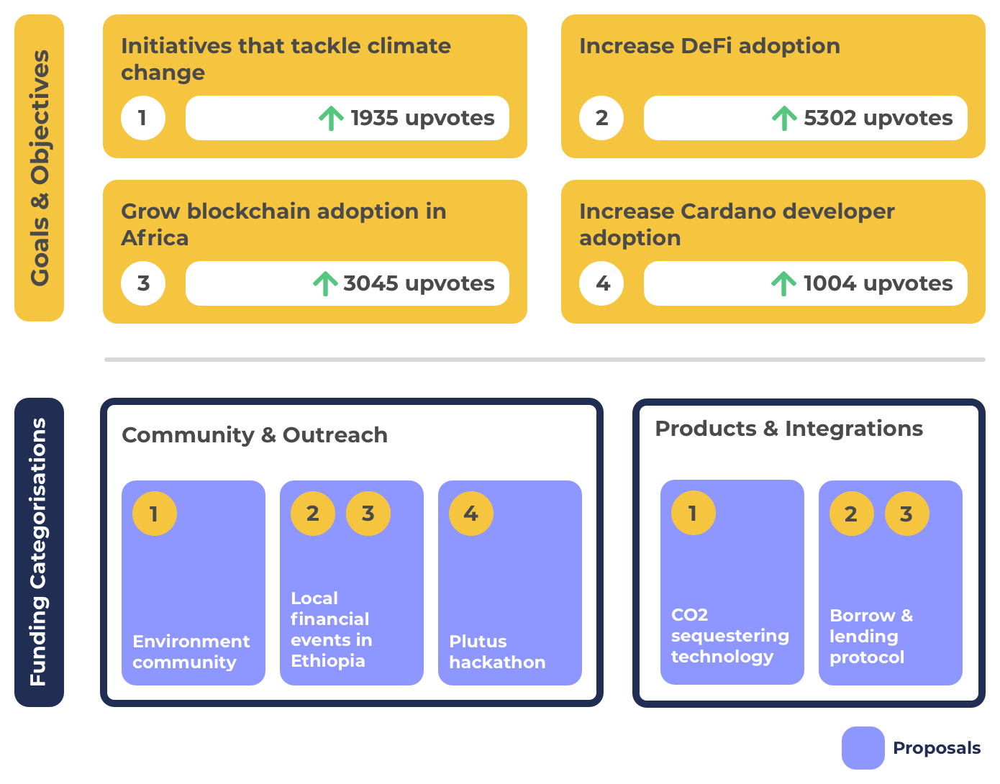

# Goals & Objectives With Funding Categories

Funding categories offer a way to drastically simplify the funding categorisation of Catalyst by using a small number of broad, recurring and inclusive categorisations. Funding categories are a category based approach to bring together proposals based upon being in a similar type or focus area. Some example types or focus areas are Governance & Identity or Community & Outreach or there are categorisations that aim to fulfil a certain function like Nurturing Ideas & Teams.

Goal or objective setting is not included within funding categories. Funding categories just focusses on effective funding categorisation. This ensures the usage of the funding categorisation remains simple, efficient, flexible and scalable.

Goal and objective setting is an important part of the funding process where the community wants to be able to indicate what they believe is the highest priority area to focus on at a given moment. Funding categories would achieve this by using an [independent goal & objective setting process](independent-goal-and-objective-setting-process.md) that can be integrated and used separately from funding categorisation.

Using an [independent goal & objective setting process](independent-goal-and-objective-setting-process.md) means getting all the benefits outlined in a separate piece of analysis. Funding categorisation remains simple, efficient and scalable and then any goal and objective setting can become dynamic and responsive to change. Goals and objectives can then be easily used and reflected in the voting experience within Catalyst. Auditability of the outcomes of meeting objective would also not be part of the funding categorisation decisions and instead be part of a separate auditing process.

**Funding categories promote recurring, inclusive and broad categorisation**

* **Recurring** - Categories based on topic areas or that fulfil a certain function can be defined upfront and used in each funding round. This makes them a suitable choice for recurring categorisation. Categories could still change but only need updating when it is necessary.
* **Inclusive** - Categories that group proposals by type can more easily be inclusive to all forms of idea and innovation. Funding categories have been designed to be suitable for being an inclusive form of funding categorisation**.**
* **Broad** - Topic area and function focussed categorisation is well suited to offering broad categorisation that invites multiple proposal types. Categorisation could also be made more specific on what types are included however this comes at an increase cost of complexity around determining budget weighting for each categorisation and makes the categorisation less flexible to dynamic changes.

**Advantages**

* **Dynamically changing** - Categories are flexible to dynamically changing goals and objectives as the categorisation doesn’t specify what must proposals must focus on. This allows the community to update or add new objectives dynamically at anytime as they emerge. This improves the speed in which proposals of higher priority can be identified and supported in the funding process.
* **Simple** - Usage of recurring categories means no justification is needed every funding round to decide which categorisations to include. This approach removes the complexity of voters  needing to decide which categorisations to include and exclude in each funding round. Instead voters would use an [independent goal & objective setting process](independent-goal-and-objective-setting-process.md) separate from the funding categorisation process. This makes it far less complex as it would remove the decisions around budget weighting and how to handle the inclusion and exclusion of certain categorisations.
* **Lower stakeholder and governance effort** - Instead of having effort around justifying categorisations, assessing and voting on them every funding round the community would only need to put effort into the budget weightings that go into each category. As an example if the community had a number of objectives to do with improving the developer ecosystem and a number of proposals previously submitted in that categorisation the community would be able to take that information and vote on increasing the budget weighting of the ‘Development & Infrastructure’ category. By separating objective setting from funding categorisation the community reduces the effort involved in justifying and thinking through the ramifications of including and excluding certain categorisations that focus on objectives that can often change quickly.
* **Increases potential engagement** - By using an [independent goal & objective setting process](independent-goal-and-objective-setting-process.md) the community can quickly submit and vote on different goals and objectives in isolation. Their action won’t cause any negative implications on the funding categorisation process and only means sharing their opinion on what is highest priority for them. Allowing the community to do this at their own convenience with low friction makes the goal & objective setting process maximises the opportunity for the community to get engaged with this process if they want to be involved.
* **Less easy to break** - Having categories that allow for a range of proposal types with different competing objectives. This makes it less risky and easy to break for situations where there are no proposals for a given objective or goal turn up or alternatively there is only a number of proposals that are of poor quality. Broader funding categories not focussed on specific goals or objectives will reduce the risk of these situations and give the voter more choice.
* **Increases competition between goals & objectives** - Removing goals and objectives outside of funding categorisation makes it easy for categories to be inclusive of all forms of idea and innovation. This means the voters will receive the maximum amount of choice to vote on. Broad categorisations will help create healthy competition between a number of different proposals.

**Issues**

* **Low priority proposals** - People can suggest proposals that are not useful or impactful. This is not a massive issue as the voter still gets to decide which proposals are impactful or not when voting. To reduce any burden on the voter this issue can be solved by using ranking algorithms to highlight the most prioritised proposals based on the goals and objectives set by the community.

****

**Funding categories & goal setting visualisation**

* **Dynamically changing goals or objectives** - By separating out the goal and objective setting process from funding categorisation it becomes easier to use broad categorisation that encourages a larger amount of proposals with different goals or objectives. If the communities goals or objectives suddenly change this separation of concerns allows the funding process to become dynamic to these changing priorities. This is more easily achieved because the funding categorisation is broad and inclusive.
* **Multiple goals or objectives** - As per the example above a single proposal can help to achieve multiple goals which makes it clear on the intentions of the proposal outcomes.
* **Proposer simplicity** - Funding categories make proposal submission simple as proposals predictably fit into one of the categories as they collectively are inclusive to all ideas and innovation. Proposers also have the option to attach goals or objectives to their proposals that come from the independent goal and objective setting process.
* **Goal and objective focussed proposals across many categories** - Separating goals and objectives from categorisation also means proposals can exist across any of the funding categories that try to tackle the objective with a different approach.
