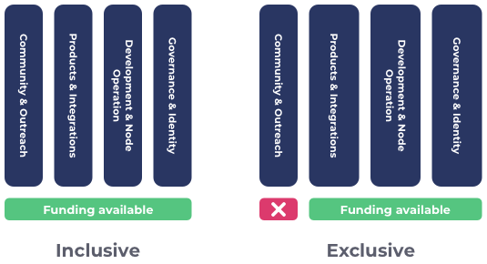

# Inclusive vs Exclusive Categorisation

### Funding categorisation: inclusive vs exclusive

For determining availability of funding to different areas the categorisation can either go for an inclusive or exclusive approach.

**Inclusive categorisation**

Inclusive categorisation means allowing all forms of ideas and innovation to be submitted by the community. With this categorisation the voters will have the maximum amount of choices available to them when deciding who to vote for during the funding process. The community will need to determine the budget weighting used for each of the categories.

**Exclusive categorisation**

Exclusive categorisation means that the categorisations used in a given funding round do not allow for all forms of ideas and innovation. Exclusive categorisation favours providing more funding capacity in certain areas at the expense of others receiving any funding access. The community will have to both justify the categorisations to exclude and then also determine what budget weightings to apply to the ones included.

### **Factors to consider**

* **Open or restrictive funding** - How hard or easy is it for all forms of ideas and innovation to request funding due to the categorisation being used?
* **Budget weighting complexity** - What complexity is there for deciding the budget weightings for each categorisation approach? How much effort and how long will it take to get a well informed outcome?
* **Categorisation justification** - How complex is it to provide evidence and data to justify all categorisation selected for a given funding round? How much effort and governance is required?
* **Directing funding** - How effective is the categorisation for directing funding to certain areas that need more funding support?
* **Governance effort** - How much effort is needed to govern the specificity of the categorisation?
* **Stakeholder effort** - How much effort is required to maintain this type of categorisation from the stakeholders involved in the funding process?
* **Level of competition** - High competition can be good for selecting the best proposed ideas and innovation from a wider proposal pool but comes at the cost of making it more challenging for smaller teams. Lower competition for categorisation has the benefit of helping spread the competition difficulty that will help smaller teams but comes at the cost of an increased chance of funding innovation that is not as effective due to the lower competition.

### **Inclusive funding categorisation**

**Advantages**

* **Open funding** - All forms of ideas and innovation would be included. This means maximising the amount of options the voter has to choose from when deciding where to allocate funding. Inclusive categorisation helps to ensure funding is more [egalitarian](../categorisation-analysis/egalitarian-funding-categorisation.md).
* **No categorisation justification** - No effort is needed to justify the categorisation as the categorisations used cover all forms of ideas and innovation will be included.
* **Easy to direct funding** - Inclusive categorisations would have their own budgets. Voters would be able to decide where to allocate more or less funding each funding round to better direct funding to where it is needed.
* **Low governance effort** - For inclusive categorisation the only governance required is around the budget weightings between the categorisation which can be done in a single vote.
* **High competition** - Distributing the funding into categorisations that invite all ideas and innovation means the maximum higher volume of idea diversity can be submitted which helps to drive increases in competition. Being inclusive also means there would be a more limited amount of funding between all of the categorisations. This further drives funding scarcity and promotes healthy competition.

**Issues**

* **Moderate budget weighting complexity** - Having categorisations that are inclusive of all ideas and innovation means that there is complexity in needing to consider what budget weighting to apply to all of these categorisations that are defined. The broader the categorisations are the less this would be a problem.
* **Moderate stakeholder effort** - Those involved in deciding the categorisation would need to understand any information around reasons to either increase or decrease a categories budget weighting to make well informed decisions.

****

### **Exclusive funding categorisation**

**Advantages**

* **Low to moderate budget weighting complexity** - The complexity could often be lower than inclusive competition for budget weighting decisions because the budget weightings only need to be applied for the categorisations that are included. This reduction in complexity assumes the same level of specificity for when comparing inclusive and competitive categorisation as then the voter would not need to consider as many different areas of the ecosystem.
* **Easy to direct funding** - Exclusive categorisation would mean being able to direct more funding to certain areas over others from a limited funding amount. This makes it easy to direct funding to those areas.&#x20;

**Issues**

* **Restrictive funding** - Only certain categories will be selected meaning it will limit what ideas and innovation can be submitted which can stifle progress and innovation in certain areas of the ecosystem.
* **Lower competition** - Excluding certain areas in the ecosystem with exclusionary categorisations means that the amount of total competition is reduced in each funding round. By increasing the amount of funding for the areas that are included the competition in this area is also decreased as they would have access to more funding than if inclusive categorisation was used.
* **Very difficult categorisation justification** - Exclusive categorisation requires a lot of effort to provide justification as to why certain categorisation should be included and excluded. These decisions define what areas have access to funding. Large amounts of data, analysis and confidence would be required for those involved in this decision to be well informed.
* **High governance effort** - Exclusive categorisation requires a larger amount of governance effort for those that make the decision of what to exclude as they must be highly informed of how they can justify why certain categorisations will be included or excluded. This means the governance process must allow for sufficient research and analysis of the ecosystem to make an informed decision. A large consideration for this complexity is that exclusive categorisation means the community would need to be more confident that the best proposals from the excluded categorisations are likely to be worse than the worst proposals in the included categorisations. Finally, for the categorisations that are included the budget weighting governance decision also must be made.
* **High stakeholder effort** - Those involved deciding the categorisations to include and exclude must have sufficient depth of ecosystem understanding to make the decision on categorisation justification and also the budget weightings. Exclusive categorisations would require more oversight and moderation.

****

### **Summary**

* **Both approaches can be effective for directing funding** - In either approach the community is able to increase or decrease the amount of funding that is directed towards certain areas. Exclusive categorisation however does mean the funding would be more heavily directed to certain areas at the full expense of ideas and innovation in others.
* **Complex categorisation justification** - The complexity of the justification required for exclusive based categorisation is very high and is ideally is an issue worth avoiding due to the complexity. By removing funding for certain areas the community makes a guess ahead of time without sufficient data of where the best innovation will come from and leaves no opportunity to be wrong. This is far riskier in terms of funding allocation as it is difficult to predict what forms of ideas and innovation will show up in a short period of time and which of those proposals will also be the most promising.
* **More governance and stakeholder effort with exclusive categorisation** - Exclusive categorisation means more effort is required around the justification of excluding or including certain areas for funding. Increased effort is required for supporting the information flow into governance decisions, governing the outcome of those decisions and also increased effort required by those involved in making the decision anytime these categorisations are changed.
* **Inclusive categorisation is less risky and easier to manage** - Inclusive categorisation means not making risky predictions on how innovation will present itself. Instead inclusive categorisation allows all forms of idea and innovation and the main complexity for the community to deal with is the budget weighting between the categorisations. Inclusive categorisation has the large benefit of maximising the amount of options the community has to choose from when deciding where to allocate funding and also maximising the amount of healthy competition.
