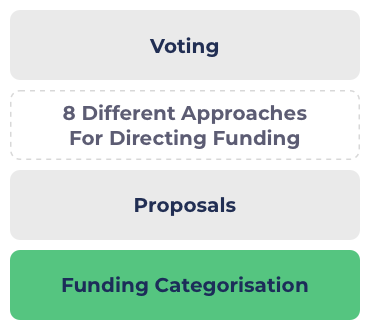

# Catalyst Ecosystem Priorities

The following are some suggested functional priorities for what the Catalyst ecosystem should support to improve how the community can use that system to decide how to distribute funding.

Please read [approaches for directing funding](catalyst-ecosystem-priorities.md#approaches-to-directing-funding) and [egalitarian funding categorisation](../categorisation-analysis/egalitarian-funding-categorisation.md) before reviewing this document.

The priorities below are completely up for debate but help to provide a starting point for the discussion.&#x20;

**FEEDBACK AND THOUGHTS** - If you have suggestions for other suitable priorities for different stages in the catalyst ecosystem please send your feedback and they can get added to the document: [https://t.me/catalystfundingcategories](https://t.me/catalystfundingcategories)

The funding categorisation is at the core of the funding process. It determines what proposals can be submitted, how effective any efforts are from the community to direct that funding and also what ideas can be voted on.

Below we'll consider any general high level funding priorities for the Catalyst system as a whole and then also some priorities for the different stages of funding.

The goal of these priorities are more focused on what the Catalyst ecosystem should be supporting from a functional and process level rather than focus on opinions on where funding should be distributed towards. Opinions on where funding should be distributed come from the community, can be ever changing, and will be applied when using the Catalyst governance system.

### General priorities

Priorities for the overall Catalyst ecosystem for helping distribute the Cardano treasury.

**Fund proposals that can produce a high impact for the ecosystem**

The overarching goal for the distribution of funding is for the receivers of funding to provide a high impact to the ecosystem. This impact could be achieved through different ideas, support and changes.

****

### Funding categorisation priorities

**Support all forms of idea and innovation**

Funding categorisation does not need to have opinions on which ideas and innovation are good or bad. The categorisation should support all forms of ideas and innovation to maximise the options the community has to choose from. With these options the community can then determine themselves what they believe will produce the most impact.

**Open and fair access to funding opportunities**

Everyone should have equal and fair access to funding opportunities so that they are able to execute their suggested ideas and innovation.

****

### **Proposal priorities**

**Maximise quality of proposal**

All proposal teams should have sufficient information, guides and tools available so that they are able to submit a high quality proposal.

****

**Increasing support to the proposal teams**

Proposal teams should get support when it is needed to create quality proposals. Support could include proposals structure, language translation and providing awareness to existing ecosystem projects and initiatives to aid in understanding and encouragement of collaboration.

### Approaches for directing funding

**Improve information flow**

The community should have access to any relevant information so that they are effectively able to make a well informed opinion about the funding opportunities that have been submitted. Areas within this priority can include information about ecosystem data, tagged proposal to filter them easily, any community interaction and feedback given to proposals and all the catalyst funding history data.

**Improve access to community thoughts and consensus**

The community should be able to share their opinions and vote on what areas of the ecosystem are important focuses to create high impact. Some ways in which this can be achieved are community priority votes, community problem votes and community members creating ecosystem priority reports.

****

### **Voting**

**Ensure voting remains private**

Voters should be confident their votes can remain private to ensure that others can't as easily influence their voting decisions or see how they've voted.
