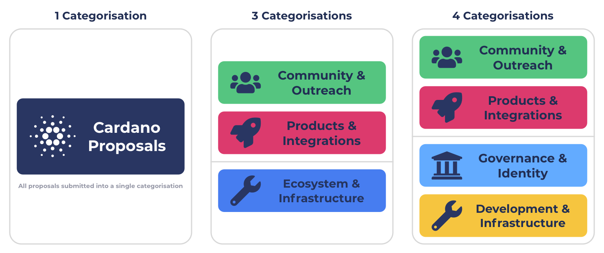

# Alternative Idea Funding Categorisations

The current recommended approach for supporting idea based proposals is to use four idea based categorisations in the initial implementation of funding categories. The two main alternatives worth considering is using a single idea funding categorisation or using three idea funding categorisations.

### Rationale for recommending four idea funding categorisations

**Lack of voting infrastructure that helps with directing funding effectively**

There is currently a severe lack of effective tools and processes for helping the community to easily direct funding. Tools and processes are important for making it easier for voters to identify and compare high impact initiatives. Due to the infrastructure not being ready it makes a single categorisation approach or the use of very broad categorisations more difficult to handle in the short term. In fund 9 for the products & integrations category showed evidence of this difficulty where the community had to handle over 400 proposals in a single categorisation. Using four categorisations compared to one or three helps to prevent exacerbating this existing issue and allow for more time for more tooling and processes to get created and improved.

**Easier to use with lower complexity voting decisions**

Four categorisations are easier to use at the voting stage as when voters compare proposals in each category the proposals are grouped around similar focus areas. This reduces the complexity as voters don’t need to compare the tradeoffs between proposals aimed at too many focus areas at once. Categorisations with sensible focus area groupings help give the voter the option to decide which categorisations they want to spend time on themselves so they can vote on proposals they believe will create the most impact. When there are categorisations where voters have less knowledge about the focus areas or when they just have less capacity the voter could seek external opinion from experts or dReps. In future implementations of dReps voters may even be able to choose to delegate responsibility of certain categorisations to dReps so they can fully focus on the areas they want to participate in.

**Protects important focus areas**

By grouping all the different potential focus areas into four categorisations it helps to better protect less popular focus areas by giving at least a guarantee that some funding will be made available to a variety of different focus area groupings. This helps to reduce some of the drastic variance in outcomes that can occur from just using a single categorisation and better protects important focus areas.

**Better for dRep focus and specialisation (consideration for future dRep implementation)**

The four categorisations are broad but have enough focus areas included to ensure there is a healthy amount of competition. Using four categorisations offers dReps the choice to spend more of their capacity to understand and spend time on a single categorisation to make well informed voting decisions. This would only be relevant for future implementations of dReps where the voter could delegate voting power to dReps for different purposes. In the initial implementation you delegate a total amount of ADA in full to the dReps to vote on everything. If voters had the options to only be delegate to dReps for certain categorisations they would not have to consider focus areas in other categorisations where they do not have expertise or the capacity to do so. Instead they would be able to focus on the categorisations with the focus areas they are more informed about and spend more time in to make well informed decisions.

### Idea funding categorisation options

<figure><figcaption>
Comparing idea funding categorisation options
</figcaption></figure>


[one-categorisation.md](one-categorisation.md)



[three-categorisations.md](three-categorisations.md)



[four-categorisations-recommended.md](four-categorisations-recommended.md)


### Other funding categorisation considerations

**Nurturing Ideas & Teams**

New ideas and smaller or lesser known teams could likely struggle to compete in broad categorisations if they must compete with the established projects who already have a good reputation in the ecosystem. This would especially be the case for a single categorisation approach which would mean every proposal would be competing with every established project in the ecosystem that submits a proposal. The issues of the funding process becoming a popularity contest increases when you reduce the number of categorisations and increase the amount of competition between proposals. Other categories can be created to support funding initiatives for smaller ideas and teams such as the suggested Nurturing Ideas & Team category. It could be beneficial to use this approach for funding categorisation alongside any of the idea based categorisation approaches suggested above. The use of an extra categorisation for this purpose does not need to be included in the comparisons between the main idea based categorisation options.

**Contributor funding categories**

Introducing a contributor funding model is a way to add a recurring incentive structure to support, maintain and improve the ecosystem and pass stewardship over to the community. Using this type of incentive structure can be useful regardless of which idea based categorisation approach is being used so due to this won’t be mentioned in the comparisons between the options for idea funding categorisations.
