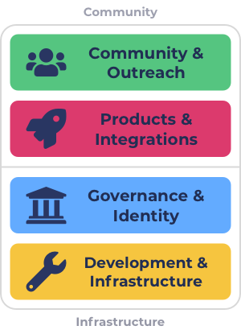

# Four categorisations (Recommended)

### **Overview**

The four suggested categorisations include Community & Outreach and Products & Integrations which are more focussed on community members with end user solutions or initiatives about the wider community. The remaining two categories are Governance & Identity and Development & Infrastructure which are more focussed on the infrastructure and processes in the ecosystem.

<figure><figcaption>
Four categorisations
</figcaption></figure>

### **Advantages**

****

**Low budget weighting complexity**

Using four categorisations means only a high level decision would be needed from voters to decide how to distribute funding between these categories. The less categories being used the less overall information is needed to be informed enough to make a sensible budget weighting decision. The budget weighting decision can also be further simplified in the future by using approaches that help to scale funding categories.

**Effective in challenging funding situations**

The four categories invite a large number of focus areas into each categorisation which makes them sufficiently flexible to challenging funding situations. Only a subset out of the focus areas included in each category need to turn up with quality proposals for funding to be allocated to impactful initiatives.

**High competition**

There is enough focus areas in each category to create healthy amount of competition between proposals however the categorisations are also not too large that the difficulty of directing funding becomes excessive due to the variance of potential options. Some focus areas will still be more popular than others but having four categorisations will help to at least limit the impact of some dominant focus areas impacting the rest of the ecosystem. With four categorisations the competition appears to be fairly balanced based on the similar breadth of focus areas included in each category.

**Higher dRep effectiveness**

By using a small number of categorisations to group certain focus areas the dReps that emerge in the ecosystem can choose to specialise on certain categorisations. This helps increase the effectiveness of each dRep as they will be able to use more of their time and capacity to make well informed decisions for a specific categorisation.

### **Issues**

****

**Some difficulty for less popular focus areas**

There is at least some difficulty with using four categorisations as some focus areas may struggle to get funding over others due to some areas being more popular.

**Moderately high voter decision complexity**

Four categorisations will mean each category will have a fairly large amount of options to choose between in terms of the proposals submitted. This amount of variance between focus areas increases the decision complexity for the voter. Voters will need to understand the tradeoffs between the grouping of focus areas included in the category to make an informed decision on which proposals to vote on. Having high quality voting infrastructure that uses a number of approaches to help with directing funding is needed to help reduce decision complexity.

### Summary

* Four categorisations helps to produce a number of advantages with a low amount of budget weighting complexity and being effective in challenging funding situations. Four categorisations has more balance on the amount of competition it creates between similar focus areas so that proposals are competing with more similar proposals. Four categorisations should also be more effective than three in helping dReps better specialise on the focus areas in the categorisation focus area groupings to make better informed voting decisions.
* The only main issues with the suggested four categorisations is there is still some difficulty for less popular focus areas and a moderately high decision complexity. These issues can be reduced or resolved through the use of integrating and improving approaches to help with directing funding.
* Four categorisations offers a balanced approach to splitting many focus areas between a number of broad and inclusive categorisations. As the ecosystem is not mature and there is a lot of tools, infrastructure and processes needed in the focus areas of governance & identity or development & infrastructure categories there is a merit to keeping these separate to ensure progress is made on those areas that benefit the strength of the developer ecosystem. Due to the lack of effective approaches to direct funding being implemented in the voting infrastructure there is also sufficient rationale to use four categorisations in the short term over three categorisations to better protect less popular but important focus areas. Once the tools and processes improve over time and the amount of data on four categorisations is assessed then adjustments can be made to the categorisations or number of categorisations based on factual evidence and informed feedback.
