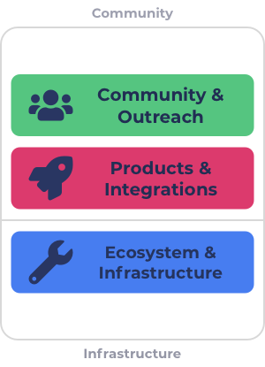

# Three categorisations

### **Overview**

The three suggested categorisations would include Community & Outreach and Products & Integrations that are more focussed on community members with end user solutions or initiatives about the wider community. The other category is Ecosystem & Infrastructure which would be a combination of the Governance & Identity and Development & Infrastructure categories merged into one. Ecosystem & Infrastructure is more focussed on the infrastructure and processes in the ecosystem.

<figure><figcaption>
Three categorisations
</figcaption></figure>

### **Advantages**

****

**Low budget weighting complexity**

Using three categorisations means only a high level decision would be needed from voters to decide how to distribute funding between these categories. The less categories being used the less overall information is needed to be informed enough to make a sensible budget weighting decision. The budget weighting decision can also be further simplified in the future by using approaches that help to scale funding categories.

**Effective in challenging funding situations**

The three categories invite a large number of focus areas into each categorisation which makes them sufficiently flexible to challenging funding situations. Only a subset out of the focus areas included in each category need to turn up with quality proposals for funding to be allocated to impactful initiatives.

**High competition**

There is enough focus areas in each category to create healthy amount of competition between proposals. The category for Ecosystem & Infrastructure may potentially have too much competition due to the number of focus areas invited into the category. Some focus areas will be more popular than others but having a few categorisations will help to at least limit the impact of some dominant focus areas impacting every other area in the ecosystem. The three suggested categorisations could be further changed to be more balanced as long as they remain easy to understand and use. Alternatively using four categorisations may be easier to achieve a balanced competitive group of categorisations.

**Moderately high dRep effectiveness**

By using a small number of categorisations to group certain focus areas the dReps that emerge in the ecosystem can choose to specialise on certain categorisations. This helps increase the effectiveness of each dRep as they will be able to use more of their time and capacity to make well informed decisions for a specific categorisation.

### **Issues**

****

**Some difficulty for less popular focus areas**

There is at least some difficulty with using three categorisations as some focus areas may struggle to get funding over others due to some areas being more popular. This could more easily be the case for the Ecosystem & Infrastructure category as it combines a large amount of focus areas into one categorisation. This much larger categorisation increases the risk that some focus areas struggle to get funding and also increases the voter decision complexity due to the wider range of proposals that can be submitted into that one categorisation.

**High voter decision complexity**

Three categorisations will mean each category will have a fairly large amount of options to choose between in terms of the proposals submitted. This amount of variance between focus areas increases the decision complexity for the voter. Voters will need to understand the tradeoffs between the grouping of focus areas included in the category to make an informed decision on which proposals to vote on. Having high quality voting infrastructure that uses a number of approaches to help with directing funding is needed to help reduce decision complexity.

### Summary

* Three categorisations helps to produce a number of advantages including a low amount of budget weighting complexity and it being effective in challenging funding situations. It also helps with balancing the competition more effectively between similar focus area so that proposals are at least competing with more similar proposals. The categorisations can also help with increasing the effectiveness of dReps that can better specialise on certain focus areas to make better informed voting decisions.
* The issues with the suggested three categorisations is the focus area groupings are more unbalanced due to the amount of focus areas included in the Ecosystem & Infrastructure category. This issue impacts the voter decision complexity which was another issue that can be reduced as better approaches to direct funding are introduced.
* There is no immediate rush or need to move from four categorisations down to three as the budget weighting complexity is similar with four categorisations and four categorisations would still yield the same benefits of healthy competition and being effective in challenging funding situations. Four categories would be better for dReps in being able to specialise and focus on certain groupings than three categories due to a better defined separation of focus areas. The severe lack of processes and tools for effectively directing funding in the voting process provide sufficient rationale to lean towards being cautious in how broad the categorisations are when transitioning to funding categories. Due to this using four categorisations over three appears to be the more sensible option in the short term.
