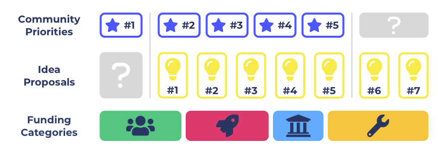

# Community Priorities & Idea Proposal Supply Dynamics

<figure><figcaption>
<strong>Implications of community priorities &#x26; idea proposals for funding categories</strong>
</figcaption></figure>

## **Community priorities**

Community set priorities are how the community express what areas they believe are the most important to allocate more effort and resources. One way in which the community could set priorities is by using goals and objectives. The community could vote on which of the suggested priorities is the most important.

**Factors to consider**

* Community priorities could be set for a range of reasons including due to new problems, ideas, data and insights. Priorities could change quickly from one day to the next due to a fast changing ecosystem or simply because the communities preferences have changed.
* Community priorities could be set for use during a specific time period or it could be a continuous process that the community can always participate in. A continuous process for setting priorities would be more flexible to situations where sudden important priorities emerge.
* Community priorities could be integrated into the voting process to influence the ranking of proposals. Searching or filtering proposals based on whether they address a certain priority could also be introduced.
* Priorities can have situations where no proposals are submitted in a given funding round that are trying to address certain priorities. There can also be situations where the proposals submitted are not of a high enough quality. Funding categorisations should ideally be able to handle this situation so funding is not poorly allocated.
* Completed proposals that were addressing community priorities could be listed on those priorities for the community to see. The community would be able to react and respond to any completed initiatives that tried to address certain priorities to then determine and vote on whether that priority still needs more resources.
* Analysis on community priorities will be needed to determine which voting approaches are most suitable for being inclusive and effective at handling the diversity of opinions and preferences in the community.
* Community priorities are not currently set in a separate process in the ecosystem. If they are in the future then proposals could be assessed based on whether they are relevant for addressing any of the existing community set priorities. This assessment could influence the ranking of proposals and how they are filtered, ranked and sorted at the voting stage.
* To facilitate a wide range of priorities in the funding process it would be important to effectively handle how they are created, moderated, voted on, ranked and how those priorities influence any proposal rankings.

### I**mplications for funding categorisation**

****

**Number of priorities**

A large number of priorities can exist at any given moment. The larger the amount of priorities the harder it would become to distribute budgets between each of the priorities effectively. This leads to solutions of either being exclusive on which priorities can be addressed or by keeping priorities separate from funding categorisation so that any priorities can be included. This would mean supporting a wide range of priorities being able to exist at a given moment. Excluding priorities and giving proposals addressing those priorities less chance to participate without fully assessing their potential impact increases the risk of stifling innovation. The community would need to be confident ahead of time that they are making well informed decisions and they aren’t preventing high impact initiatives from being considered. This is one of the reasons that the adoption of inclusive categorisations is a preferred approach as it provides a more flexible solution to a respond to a wider range of situations.

**Urgency of priorities**

How urgent a priority is will be relevant for funding categorisation as the community will want to be able to respond to a fast changing environment. If a priority suddenly becomes urgent then it will be important for the funding categorisations being used to be able to accept proposals for that priority at that precise moment. This provides rationale for why funding categorisations benefit from being inclusive so that they are more flexible at handling rapidly changing environments. Another way that urgent priorities could be better handled is if priorities influence the ranking of proposals and favours those which are addressing these urgent priorities.

**Diversity of priority timelines and complexity**

Some priorities could be achieved with a single proposal or a little bit of collective effort from the community where as others may require longer periods of time and far more resources. Proposals that try to address these priorities will not necessarily show up at the time that the priorities are set. There could be a small to large delay depending on whether the community has the skills, knowledge, capacity or even desire to commit the required effort and resources towards addressing a certain priority. This variance in timelines and complexity of when and how priorities can be achieved provide reasoning in using broad funding categorisations that don’t focus on a single priority. Flexible categorisations help to allow sufficient time and flexibility to the fact that priorities can influence what proposals get submitted and funded but they can’t create any guarantees that the right initiatives will be submitted as proposals to address those priorities in the short term. Broad categorisations allow multiple competing priorities to be submitted which means that the effective distribution of funds isn’t fully reliant on quality proposals needing to respond to a single priority at that precise moment.

**Popularity of priorities**

Anyone from the community can come up with their own priorities that they believe are important to address. Some of these priorities will come from minority communities which will struggle to get the same support from the wider community when competing with more general and wider impacting priorities. Creating a priority setting process that invites a diversity of priorities would be valuable for creating a more inclusive process that accepts a wider range of ideas. This prevents community priority setting becoming a popularity contest that only supports what the majority wants to prioritise. Allowing for a mixture of priorities to be considered increases the opportunity for the community to consider alternative proposals at the voting stage. They would then be able to more easily see which proposals address which priorities and how impactful those initiatives could be. Just because a priority is not as widely upvoted and supported by the community at a specific time does not mean that proposals addressing that priority couldn’t create a larger amount of impact than the other proposals.

**Priority based funding categorisations**

If funding categorisations were based on priorities and budgets were instead attached to those priorities it would result in the highest voted priorities being used as funding categorisations. This approach becomes more complex as the number of priorities increases as there is either an increasingly complex budget weighting decision to make or the need to exclude certain priorities. Being exclusive is an issue for categorisations as they are set ahead of time. This could mean stifling innovation that was addressing other important but excluded priorities. Keeping priorities separate from funding categorisations allows for more flexibility in supporting a range of priorities in a single categorisation. Setting priorities separately also puts far less pressure on priority setting process. If the community makes a mistake they are easily able to update their vote on what are the highest priorities and can also direct their vote to any other focus area at the voting stage. The community would still likely vote on the proposals that address the most important priorities but now they would also be able to at least consider proposals that are tackling smaller priorities but could still be equally or even more impactful.

**Other ways to address priorities**

Broad and inclusive funding categorisations are an effective way to invite proposals which address a wide range of community priorities. Other incentive mechanisms can also be experimented with to help with addressing priorities. Bonus awards for proposals that address the most important priorities could be one approach. Another could be using a matching pool fund where community members can vote with their ADA. Their contribution amount could be matched either using quadratic funding or a similar mechanism from the matching pool fund. There is likely a much wider range of other ideas and incentives to be explored and experimented with that could help incentivise addressing priorities set by the community.

## Idea proposal supply

Idea proposal supply is the total amount of idea proposals that get submitted in each funding round. The submitted ideas will cover a range of focus areas and priorities. The idea proposals are what the community will actually be comparing and voting on when considering who should receive funding.

**Factors to consider**

* Proposals can be submitted when the proposal is focussed on a focus area initiative that is accepted by at least one of the categorisations in a funding round. Proposals can submitted by individuals or multiple team members within a project.
* Proposals may or may not be submitted as a response to the current priorities set by the community. Proposals that don’t address any existing priorities can still be submitted. Proposals could end up creating their own demand within the community by simply being a high quality idea or team.
* Proposals can be updated after submission but are locked from being changed anymore after they move into the voting stage. If a proposal is not funded it can be improved where necessary and then submitted again in the next funding round. This is providing the funding categorisations still invite that type of initiative. This would always be the case if inclusive categorisations are being used.
* There is no guarantee that the supply of idea proposals submitted will match the priorities of the community. There is also no guarantee that the idea proposal supply which is trying to address community priorities are actually of a high enough quality to receive funding.
* To handle a wide range of proposals it will be important to let voters search, compare, filter, sort and rank proposals effectively so that can make informed voting decisions. Voters also would benefit from knowing which priorities a proposal is trying to address.

### I**mplications for funding categorisation**

****

**Number of proposals**

The number of idea proposals submitted into a categorisation impacts how easy it is to view and compare the proposals. The larger the number of proposals the harder it can become for comparing and voting on high impact initiatives. Supporting a larger amount of proposals in a single categorisation will increase the need for effective searching, filtering, ranking and sorting. If some categorisations are constantly receiving a larger amount of proposals than other categorisations then this could also be a factor towards making considerations about how to best structure the categorisations or whether the current approach is still effective.

**Quality of proposals**

To better achieve impactful outcomes a sufficient number of high quality proposals need to be submitted into each funding categorisation. Using broad categorisations is one approach that can help with inviting a wide range of focus areas to increase the chance of finding enough quality proposals amongst those which are submitted. When a funding categorisation accepts an increasing amount of focus areas there is more flexibility that the categorisation can handle situations where certain focus areas don’t turn up with quality proposals. Variance on the quality of proposals being submitted also increases the importance of how the proposals are ranked. As the number of proposals increases the effectiveness and precision of how proposals are ranked will need to be improved wherever possible.

**Diversity of idea proposals**

Funding categorisations determine what diversity of ideas can be submitted. If funding categorisations are exclusive then they risk stifling innovation in instances where the excluded proposals could have produced more impact than the worst funded proposals from the areas that were included. Funding categorisations are set ahead of time which increases the difficulty in predicting what type of ideas should and should not be included. Inclusive categorisations are one approach to encourage a diversity of ideas and give the voters more optionality at the voting stage to consider which ideas are actually the most promising.

**Proposals that don’t address existing priorities**

Proposals may or may not want to address the community set priorities. The proposers may have a novel new idea that the community hasn’t thought about. Or the proposers are trying to solve a problem that the community isn’t as aware of. Funding categorisations benefit from being inclusive to support these situations. It is difficult to predict ahead of time what ideas the community will come up with that could be highly impactful.

**Competition between proposals**

Each of the focus areas will have a different level of popularity from proposers and with the voters. Some focus areas could have many proposals submitted for that focus area where as others see few proposals. The amount of competition between proposals will be influenced by the number of focus areas invited into each categorisation. An excessive amount of competition in a single categorisation compared to other categorisations could provide rationale for changing a funding categorisation to better balance the competition if this is necessary. Healthy competition is a good outcome for the funding process so having high competition in a categorisation would not necessarily mean anything needs to be changed. It will be important to monitor the competition between proposals in each funding categorisation and make observations and considerations towards whether each categorisation is effective in its current form.

**Ideas tackling multiple priorities**

Some ideas will be trying to tackle a number of priorities instead of just one. For instance a DeFi application launched in Ethiopia would match a priority to increase blockchain adoption in Africa and also match a priority about launching new DeFi applications in the ecosystem. These situations provide rationale towards why funding categorisations benefit from being broad and that invite a range of ideas to be submitted into each categorisation. Proposals should be able to express which priorities they are relevant for and ideally should not be limited to only stating one priority when that may not be a fair reflection of the intentions and potential impact of the proposal.

## Summary

*   Idea proposals benefit from being able to be submitted into broad and inclusive categorisations. This is due to to broad and inclusive categorisations being:

    * More flexible in handling a variance of quality for the proposals submitted across focus areas
    * Effective for attracting a diversity of ideas and not excluding or stifling potentially highly impactful innovation
    * Accepting of unexpected proposals that the community may not have been thinking about but demonstrate that they could be highly impactful when properly considered
    * Effective for creating healthy competition between proposals

*   Community priorities also benefit from a process that is inclusive to a range of different priorities set from the community. Inclusive priority setting is effective at being:

    * More flexible to situations where highly impactful proposals are submitted that were targeting priorities that weren’t as popular as other priorities
    * Effective for allowing proposals to express which priorities are relevant to them so the community is will informed of the potential impact
    * Effective when used in parallel with inclusive funding categorisations as then the voters are able to see the full diversity of idea proposals that are submitted and then take into account which priorities are relevant to each of those proposals and what potential impact they could have

* Priorities that are set by the community benefit from being separate from funding categorisations. This means that budgets are not directly attached to priorities. Instead budgets can be attached to funding categorisations that can invite a range of ideas that are trying to address a range of priorities. The rationale for keeping priorities and funding categorisations separate is:
  * Large number of priorities - A large amount of priorities can exist in any given moment. Too many categorisations would be needed to support the diversity of priorities. This would greatly increase the complexity to effectively do budget weighting decisions for priority based categorisations.
  * Proposals having multiple priorities - If multiple priority based funding categorisations exist this creates many overlapping categorisations as there can be a number of proposals that are addressing multiple priorities. This increases the complexity to direct funding and voter complexity in trying to identify, compare and vote on similar proposals across multiple categorisations.
  * Low popularity priorities - Some priorities will have far lower popularity than others with proposers. This makes them riskier to use as categorisations as it could easily lead to misallocating resources to low quality proposals or mean not distributing any funding at all which would stifle other innovation. Keeping priorities separate from funding categorisation and using broad categorisations helps to solve this problem.
  * Diversity of priorities - Keeping priority setting separate from funding categorisation makes it easier to support having a wide range of diverse priorities rather than excluding lower popularity ones. This is beneficial as proposals could be submitted for less popular priorities that suggest a highly impactful initiative for the ecosystem that the voters could then consider.
  * Urgency of priorities - Categorisations are set ahead of time so if they are based on priorities and not broad and inclusive then they would not be as flexible to sudden priority changes. This which would be important factor in a fast changing environment and is a reason to separate funding categorisations from priorities to allows for a system where priorities can change more rapidly as needed.
