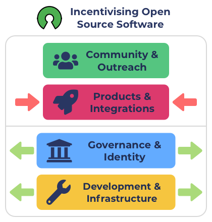

# Incentives & Game Theory For Open Source Development

### **Why game theory is important for funding categorisation?**

Game theory is the science of strategy, which includes the optimal decision-making of independent and competing actors in a strategic setting. Game theory is beneficial for modelling competing behaviours between different actors.

These actors could be projects seeking funding in the Catalyst funding process. Project teams have an incentive to request funding for paying for any work that is trying to create impact that benefits the ecosystem.

Funding categorisations are incentive structures to encourage desired outcomes. What outcomes are generated will be determined by the initiatives which can be submitted into those categorisations along with any guidelines or policies that must be followed.

Game theory is relevant to project teams seeking funding as they will need to rationally respond to how other competing teams are participating in the funding process. Based on this information they are incentivised to explore what the best strategy could be for them to increase their probability of receiving funding. Project teams will need to consider how each of the funding categorisations are being used and how they could use them to improve their chances of getting funding. The community will decide what the budget weightings are for each of the categorisations. The community ultimately determines the actual amount of incentive that is available in each funding round. Project teams respond to these incentives through the submission of their proposals.

### **Funding categorisation incentives and game theory**

Funding categorisations will have an available budget set before they can be used. These budgets determine how much of an incentive is available for the initiatives that the categorisations accepts. The incentive to be funded is a main goal for the community members participating in the funding process.

Proposals compete with all other proposals that are accepted and submitted into the categorisation. Project teams will need to consider how each categorisation is being used to determine how to most effectively achieve the goal of being funded for their initiative.

The key game theory for project teams to consider is that when considering how all other actors are participating in the funding process how can they best position their initiatives in the form of proposals submitted into the available categorisations to help them maximise their chances of being funded.

As one example scenario, most project teams could submit their proposals into the products & integrations category if they are trying to receive funding for their new application. In this same scenario there may not be many proposals submitted in the development & infrastructure category which is more related to creating open source development software. This situation creates an incentives for competing actors to respond to how the funding process is being used. The opportunity for competing project teams could be to extract out any work that is relevant and useful as open source software to the ecosystem and place this work into proposals that are submitted into these other categorisations which are less competitive.

The communities budget weighting decisions can create an incentive for project teams to respond to. The outcome of other categorisations being too competitive can lead to project teams responding to this situation by changing the focus of their initiative or submitting their proposals into other categorisations where there is lower competition.

After each funding round the community will have data about how the funding categorisations were actually used and what results were achieved. Using these insights and data the community can respond to how each categorisation was being used and adjust the budget weightings for future rounds. Improvements or amendments could also be made to the categorisations so that they function more effectively or so that they better incentivise certain outcomes that the community wants to produce. Funding categorisations can be a powerful tool for the community to create the right incentives for people to participate in the ecosystem. Effective incentives can help improve the game theory that exists for the competing actors in the ecosystem that are seeking funding. The stronger the incentives are the more the participants will benefit from considering what game theory exists to create a higher probability in achieving a desirable outcomes.

### **Funding categories game theory for open source development**

**Making better systems for the world**

Cardano is becoming increasingly capable in facilitating the pursuit of making better systems for the world. A simple example of a broad long term goal for the ecosystem could be the community wanting to see an increasing amount of applications that are improvements over existing centralised systems.

Creating a large number of applications that compete with existing centralised systems will be both time consuming and expensive to accomplish. Whether through the Catalyst funding process or external funding sources the project teams building these applications will need sufficient access to capital and also the right infrastructure and tools to use for development.

**The importance and benefits of open source**

Open source software is often a bedrock for many modern applications the world uses today. Example open source initiatives can include foundational protocols that enable the internet to function or software libraries that solve specific problems that can be adopted during application development.

The Cardano ecosystem benefits from open source software in a number of ways:

* **Increasing availability of educational resources** - Increasing the amount of open source software helps to increase the speed in which people can learn about how to develop applications in the ecosystem and the different ways it can be approached.
* **Reducing application development time & cost** - High quality open source software can be integrated into the development of applications to save developer time and effort.
* **Ability to more easily make increasingly complex applications** - As open source software gets built on top of other existing open software the amount of complexity that gets extracted out of applications can increase. This can make it easier to develop more complex applications due to the usage of strong foundations. Using open source software can make it easier for smaller teams to more effectively create even more complex and impactful applications.
* **Higher code quality and security** - Open source code can be inspected, reviewed and tested by anyone in the community. This helps to identify any problems or flaws faster and find potential areas for improvement. Improvements that benefit all developers using that software. The community has a shared responsibility and incentive to collaborate on ensuring the software they use is to a high standard.
* **Shared knowledge and skills** - If open source code is used in many applications the knowledge and skills become more transferrable between projects. This can help with increasing knowledge and skill sharing amongst the developers in the community.
* **Increase community collaboration** - Working on open and transparent software encourages individuals and teams to work together in the ecosystem under a common goal for each piece of open source software that the ecosystem is using.
* **Flexibility in how it is used** - Projects within the community can alter and amend open source code to better suit their use cases. There is no vendor lock in for how they choose to utilise and adapt the software.

The cheaper and easier it is to create applications in the ecosystem the lower the amount of funding that should be required through the Catalyst process for project teams to effectively execute their ideas. The better the developer ecosystem is with open source software and tools the faster a flywheel can be made for creating more applications that help generate more demand and growth in the ecosystem. This leads to a larger ecosystem with more opportunities and viability for even more solutions.

**Funding categories and open source guidelines**

The Products & Integrations category does not require any of the proposals submitted to be open source - although it is naturally encouraged. The categories purpose is to incentivise people to build new solutions in the ecosystem. Governance & Identity and Development & Infrastructure are categories more relevant to ecosystem infrastructure and processes. Both these categories have guidelines that ask software project proposals to be either open source or for the project to be about helping other builders developing applications.

By adding these guidelines to these categories there is a direct incentive to build open source solutions and solutions that help other builders in the ecosystem. For any projects building applications in the ecosystem this can help result in creating the incentive to identify areas of their application that could be open source and beneficial to the community and then proposing this software in these categories. If this incentive is effective it should have the knock on effect of making it easier and faster for future projects to build applications based on an increasing quality and availability of open software, infrastructure and tooling.

<figure><figcaption>
Using funding categorisations to incentivise open source software
</figcaption></figure>

Reducing the funding available in the Products & Integrations category and increasing the budget for Governance & Identity and Development & Infrastructure categories creates the incentive for projects to propose open source software. The more that Products & Integrations is restricted the more incentive there is for those same developers to think about what open source tooling they could work on that will benefit their own project as well as the wider community.

It’s not guaranteed that the projects respond to the incentive as intended and this is why it is important that the community can easily respond to what actually happens and amend the budget weightings each round. It will be beneficial to share the suggestion to project teams submitting proposals into Products & Integrations to know they could extract out the open source software from their projects and move that into proposals submitted into other categories to better encourage the behaviour.

In the longer term as the developer ecosystem and open source infrastructure, tooling and libraries mature it should become easier to develop applications in the Ecosystem. As this is achieved the reasons to increase the budget weighting for these categories will likely reduce over time. In this event it may make sense to merge the Governance & Identity and Development & Infrastructure categories together once it is the case that less work is needed for these focus areas. The Products & Integrations category could then see an increased amount of budget weighting so that more applications can be built. Those projects would then benefit from all of the quality of the tools, infrastructure and libraries that are now available in the ecosystem.

**Other approaches that help incentivise open source software**

The ranking of proposals could be influenced by whether a proposal is open source or not. If a proposal is open source it could be ranked higher than the other proposals when they have a similar assessment rating in other areas. This would create an incentive to open source any software proposals so that they receive a better proposal ranking.

Another area to consider is that the voting app could make it easier for voters to search and filter for projects which are open source. This would be another way to create a simple incentive for proposals to ensure they state their work will be open source to receive more visibility.

Finally another approach to explore is to add visual aids to make it visually clear which projects are fully open source so that it is easy to know this is the case when viewing any proposal. The benefits of open source software could also be provided as a link to the voters so that more voters are well informed of the benefit of supporting open source initiatives.

### **Summary**

* Funding categorisations create incentive structures that encourage the community to participate in submitting impactful initiatives in return for compensation. Funding categorisations can create multiple types of incentives based on the initiatives the categorisation invites, the policies and guidelines it uses and the budget weightings that get applied to each of the funding categorisations.
* Funding categorisations that encourage or even enforce projects to be open source can be an effective tool for the community to use when making budget weighting decisions to try and encourage open source projects. The community is able to increase the incentive for open source software by simply increasing the budget weighting for those relevant categories.
* Funding categorisations can be an effective approach for improving the incentives and game theory to generate certain outcomes. There are also a number of other approaches to incentivise project teams to create open source software such as increasing the ranking at the voting stage for proposals which are open source, making it easy for voters to search and filter by projects that are open source and also adding visual aids that make it clear when a proposal is open source.
