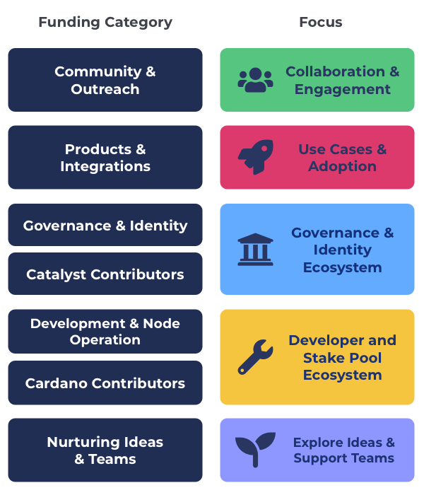

# Overview

Funding categories provide a simpler and far more effective way to do funding categorisation. Funding categories are recurring, broad and inclusive. The following categories collectively allow for any type of idea or innovation to be submitted.

**Community & Outreach**

Community & Outreach focusses on helping bring the community together and be engaged in the ecosystem. It also is for supporting outreach to new potential community members and collaborations with external people and communities.

**=>** [**Read the Community & Outreach category brief**](community-and-outreach.md)****

****

**Products & Integrations**

The Products & Integrations category focusses on finding projects that are building on top of Cardano such as DeFi, gaming, hardware devices, marketplaces, social media or any other product, application and integration.

**=>** [**Read the Products & Integrations category brief**](products-and-integrations.md)****

****

**Governance & Identity**

Governance & Identity focusses on proposals that will help with improve and support both Catalyst and the wider ecosystem around how governance and identity is used in different communities such as through from different tools, libraries, SDKs, processes or research.

**=>** [**Read the Governance & Identity category brief**](governance-and-identity.md)

****

**Catalyst Contributors**

[Catalyst contributors](https://catalyst-swarm.gitbook.io/catalyst-contributors/) help with people who want to be paid to become a full time contributor in the Catalyst ecosystem to support and improve the Catalyst ecosystem. This can include helping with development, coordination, analysis, QA & auditing, marketing, product or design.

**=>** [**Read the Catalyst Contributors category brief**](https://catalyst-swarm.gitbook.io/catalyst-contributors/category-proposal/fund-8)****

****

**Development & Node Operation**

Development & Node Operation focuses on proposals that will help improve and maintain the Cardano developer ecosystem with tools, scripts, libraries and SDKs that make it easier for developers to build applications. It also includes stake pool operation with tools and resources that will make it as easy as possible for community members to secure the network and run their own stake pool node.

**=>** [**Read the Development & Node Operation category brief**](development-and-node-operation.md)****

****

**Cardano Contributors**

[Cardano contributors](https://catalyst-swarm.gitbook.io/cardano-contributors/) is for people who want to be paid to work as full time contributors in the Cardano ecosystem. This includes those who want to help support improving the stake pool ecosystem and the Cardano developer ecosystem. Contributors would help analyse, coordinate or develop tools, libraries and SDKs for the ecosystem to use.

**=>** [**Read the Cardano Contributors category brief**](https://catalyst-swarm.gitbook.io/cardano-contributors/category-proposal/fund-8)****

**Nurturing Ideas & Teams**

Nurturing Ideas & Teams is about exploring how we can help to foster growth for ideas and new teams forming in the ecosystem. Any proposal type is welcomed as long as it is about the Cardano ecosystem in someway. There is a $40,000 maximum budget for proposals which helps to increase the number and diversity of teams and ideas that can be funded.

**=>** [**Read the Nurturing Ideas & Teams brief**](nurturing-ideas-and-teams.md)

****

**Catalyst Natives**

Catalyst Native is a model used in Catalyst where external communities can setup their own funding challenge with an allotted budget for proposals. These challenges set by these communities may or not be recurring and may only be included for one funding round.
