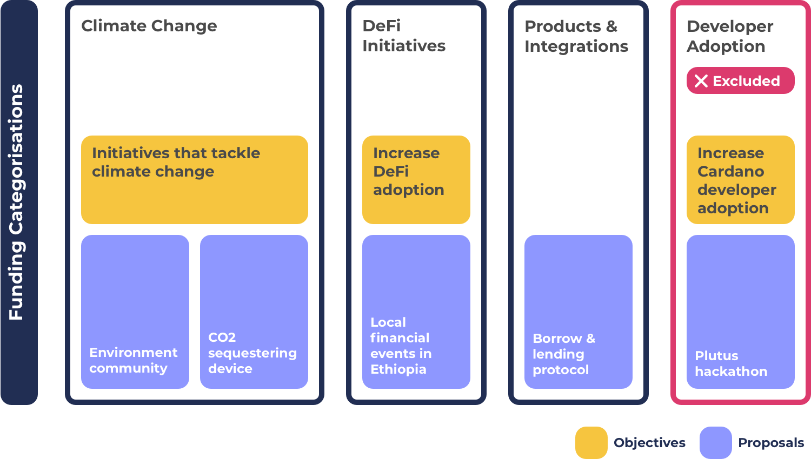

# Objective Setting With Challenge Settings

Challenge settings allow funding categorisation to be focussed around anything. This means they could range from being broad through to specific proposal type grouping or objective focussed categorisations.

The flexibility provided by challenge settings results in the inclusion of multiple problems around the lack of simplicity, efficiency, flexibility and scalability of the approach. The reason these issues are present for the challenge settings is that the process promotes specific, competitive and changing categorisation.

**Challenge settings promotes changing, competitive and specific categorisation**

* **Changing** - Objectives can be completed or increase or decrease in priority each funding round. Objective based categorisation leads to categorisation that is always changing.
* **Competitive** - There are a large amount of potential objectives that could exist and prioritised by the community. Objectives would need to compete to have access to a fixed amount of funding available.
* **Specific** - Many objectives are created to solve certain problems or add value to the ecosystem. This leads to having more specific categorisation to target those objectives. This is not true for all objectives, some could also be broad such as having a simple objective of deploying new DApps and integrations on the Cardano blockchain.

**Advantages**

* **Easier proposal comparisons** - By having categorisations focussed on objectives it makes it easier to compare and decide between proposals that all focus on one specific objective. This comparison between proposals with the same objective could also be done in category based funding categorisation however the difference is that categories can be larger in scope which means voters would need to compare the differences of proposals trying to solve different objectives as well.
* **Guaranteed objective funding** - Objective based categorisations create a guarantee that the selected objectives will have funding distributed to proposals aimed at that specific objective. This benefit also results in the majority of the issues listed below.

**Issues**

* **Inflexible** - Funding categorisation that is focussed on objectives is less flexible to sudden changes. Funding categorisation cannot suddenly change midway through a funding round. A new emerging objective during a funding round would have difficulty in supporting relevant proposals if relevant proposals for that objective were not able to be submitted to the categorisations that were available.
* **Restrictive & exclusionary** - There are potentially hundreds or thousands of potential objectives that could exist at a given moment. Different values, perspectives and interpretations from the community lead to differences in what those objectives should be and how they could be achieved. There is a limited amount of funding available in each funding round. Objective based funding categorisation can only cater for a number of objectives which results in giving the voter less proposal options to choose from. Voters would also need to accept the fact that the proposals which can’t be submitted due to this exclusionary approach may actually be more impactful than the ones being allowed due to the objective categorisation mandates. Proposers in an exclusionary funding environment aren’t given the opportunity to present ideas and innovation which could offer a more compelling objective or idea to the voter.
* **Increased risks** - Mandates on where funding is made available based on objectives increased the risks of having categorisation where proposals do not turn up to solve that specific objective. Another bad outcome is having a number of proposals submitted that are of an average to low quality. Some objectives may even have situations where the solutions are not feasible in the short term. In these scenarios funding could have been better directed to other higher quality proposals focussed on different objectives.
* **Higher complexity** - Funding categorisation tied to objective setting means there is a constant need to review ecosystem wide information to create sensible and well informed justifications on which objectives and categorisations to suggest and vote for. The more objective based funding categorisations that the community want to use the less funding that can be distributed between them from a fixed available amount. This massively increases the complexity of determining which categorisations to include and exclude and what budget weightings should be applied to each of the objective based categorisations. Objective based categorisation leads to higher efforts for governance and stakeholders to manage the process. By attaching funding categorisation to objectives the proposing challenge team must determine a suitable budget weighting or instead the community would need to vote on what budget should be applied. This complexity increases based on the number of objective based categorisations.
* **Objective setting complexity** - Go through the issues around the flexibility that categorisations can both be objectives and topics. Makes it hard to ensure important objectives are noticed and debated.
* **Poor scalability** - Objectives are set by the community and will be ever changing between funding rounds. This makes funding categorisations far harder to scale and automate with funding categorisation as they are unpredictable and not based on usage of the process. When objectives are not well known with historical data is will require more manual effort to determine a suitable budget weighting for the categorisation.

**Challenge settings and objective setting visualisation**

* **Objective & proposal exclusion** - The example above shows an example of an excluded proposal due to the categorisations included and excluded. Challenge settings encourage competitive categorisation which means it becomes easy for objectives and many proposals ideas to be excluded from a funding round. This means voters will receive less options for proposals to select from. Those excluded proposals could be higher impact than the ones that are included.
* **Difficulty with dynamic changes** - Categorisations where objective setting is a main focus result in a brittle categorisation that is less flexible to dynamic changes such as a changing objective priority. This problems occurs due to the specificity of the categorisation and its mandate on one objective area which cannot be changed once set during the funding round.
* **Complexity for proposers** - Proposals that match multiple objective focuses have increased complexity on where to place their proposals due to the categorisation overlaps.
* **Complexity for budget weighting** - As the number of objective based categorisations increase the complexity for what budget weighting to apply increases. It would be difficult to apply an accurate and suitable budget weighting to a large number of objective based categorisations. This categorisation approach also attempts to be overly predictive of how innovation should unfold. This approach is not an accurate representation of the spontaneous nature for how new ideas and innovation can emerge.
