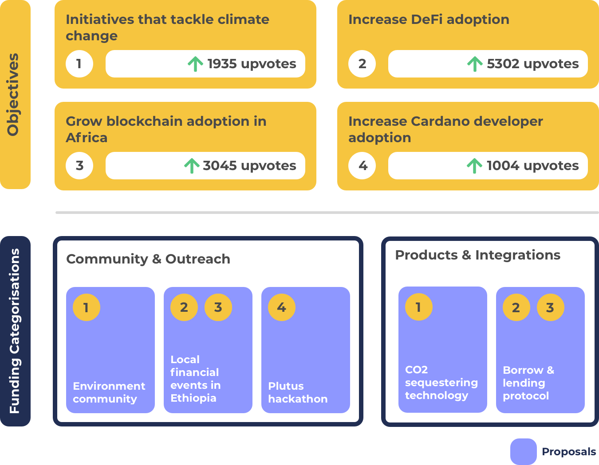

# Objective Setting With Funding Categories

Funding categories offer a way to drastically simplify the funding categorisation of Catalyst by using a small number of broad, recurring and inclusive categorisations. Funding categories use a category based categorisation approach that brings together proposals based upon similar focus areas. Category based funding categorisation is where proposal types are grouped together around a similar topic area (e.g. Governance & Identity or Community & Outreach) or aim to fulfil a certain function (e.g. Nurturing Ideas & Teams).

Objective setting is not part of funding categories. This ensures managing and usage of the funding categorisation remains simple, efficient, flexible and scalable.

Objective setting is an important part of the funding process where the community wants to be able to indicate what they believe is the highest priority area to focus on at a given moment. Funding categories would look to add an [independent objective setting process](independent-objective-setting-process.md) that can be integrated and used separately from funding categorisation.

Using an [independent objective setting process](independent-objective-setting-process.md) means getting all the benefits outlined in a separate piece of analysis. Funding categorisation remains simple, efficient and scalable and then objective setting can become dynamic and responsive to changes where those objectives can be more easily reflected in the voting experience within Catalyst. Auditability of the outcomes of meeting objective would also not be part of the funding categorisation decisions and be part of this separate objective setting process.

**Funding categories promote recurring, inclusive and broad categorisation**

* **Recurring** - Categories based on topic areas or that fulfil a certain function can be defined upfront and used in each funding round. This makes them a suitable choice for recurring categorisation. Categories could still change but only need updating when it is necessary.
* **Inclusive** - Categories that group proposals by type can more easily be inclusive to all forms of idea and innovation. Funding categories have been designed to be suitable for being an inclusive form of funding categorisation.
* **Broad** - Topic area and function focussed categorisation is well suited to offering broad categorisation that invites multiple proposal types. Categorisation could also be made more specific on what types are included however this comes at an increase cost of complexity around determining budget weighting for each categorisation and makes the categorisation less flexible to dynamic changes.

**Advantages**

* **Flexible** - Categories are flexible to changing objectives as the categorisation doesn’t specify what must proposals must focus on. This allows the community to update or add new objectives dynamically as they emerge and will help improve the speed in which proposals of higher priority can be identified and receive funding.
* **Simple** - Usage of recurring categories means no justification is needed every funding round to decide which categorisations to include. This approach removes the complexity of voters needed to decide which categorisations to include and exclude in each funding round. Instead voters can vote at their convenience in an [independent objective setting process](independent-objective-setting-process.md) separate from the funding categorisation process making it less complex due to removing the decisions around budget weighting and inclusion or exclusion of certain categorisations.
* **Low stakeholder and governance effort** - Instead of having effort around justifying categorisations and assessing and voting on them every funding round the community would only need to put effort into the budget weightings that go into each category. As an example if the community had a number of objectives to do with improving the developer ecosystem and a number of proposals previously submitted in that categorisation the community would be able to take that information and vote on increasing the budget weighting of the ‘Development & Node Operation’ category. By separating objective setting from funding categorisation the community reduces the effort involved in justifying and thinking through the ramifications of including and excluding certain objective based funding categorisations.
* **Efficient** - By using an [independent objective setting process](independent-objective-setting-process.md) the community can quickly submit and vote on different objectives in isolation and know that their action won’t cause any negative implications on the funding categorisation process. Allowing the community to do this at their own convenience with little friction makes the objective setting process more efficient for the end user.
* **Less risky** - Having categories that allow for a mixture of proposal types with different competing objectives. This makes it less risky for situations where there are no proposals for a given objective or alternatively there is only a number of proposals that are of poor quality. Broad funding categories not focussed on objectives will reduce the risk of these situations.
* **Healthy competition with maximum voter options** - It is easy for categories to be inclusive of all forms of idea and innovation. This means the voters can be given the maximum amount of choice and the broad categorisation will help create healthy competition between a number of different proposals.

**Issues**

* **Low priority proposals** - People can suggest proposals that are not useful or impactful. This is not a massive issue as the voter still gets to decide which proposals are impactful or not. To reduce any burden on the voter this issue can be solved by using ranking algorithms to highlight the most prioritised proposals at the voting stage as well as other attributes of a proposal that demonstrate they are of a higher quality.

****

**Funding categories & Objective setting visualisation**

* **Dynamically changing objectives** - By separating out the objective setting process from funding categorisation it becomes easier to use broad categorisation that encourages a larger amount of proposals with different objectives. If the communities objectives suddenly change this separation of concerns allows the funding process to become more dynamic to changes because the funding categorisation is more flexible due to being broad and inclusive.
* **Multiple objectives** - As per the example above a single proposal can help to achieve multiple objectives which makes it clear on the intentions of the proposal outcomes.
* **Proposer simplicity** - With funding categories the proposals are submitted into categorisations based on the proposal type or grouping. Proposers would also have the option to attach objectives to their proposals that come from the independent objective setting process.
* **Objective focus across categorisations** - Separating objectives from categorisation also means proposals can exist across any of the funding categories that try to tackle the objective with a different approach.
