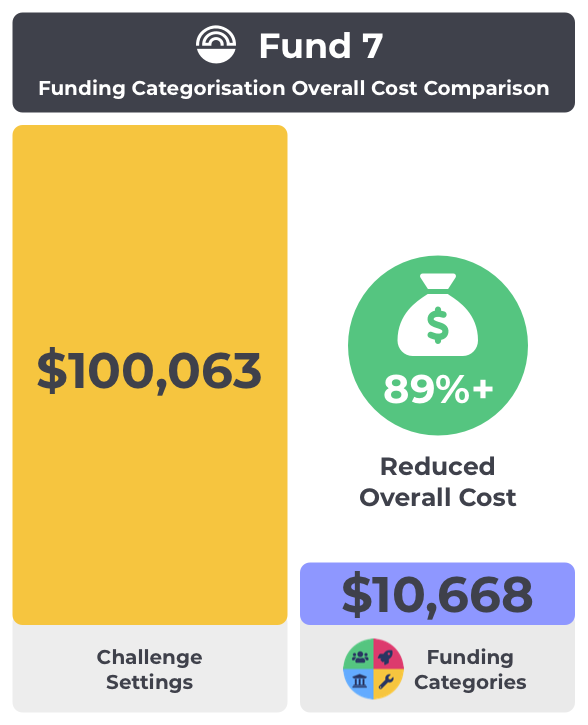
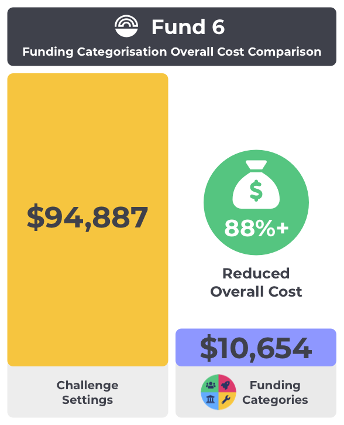
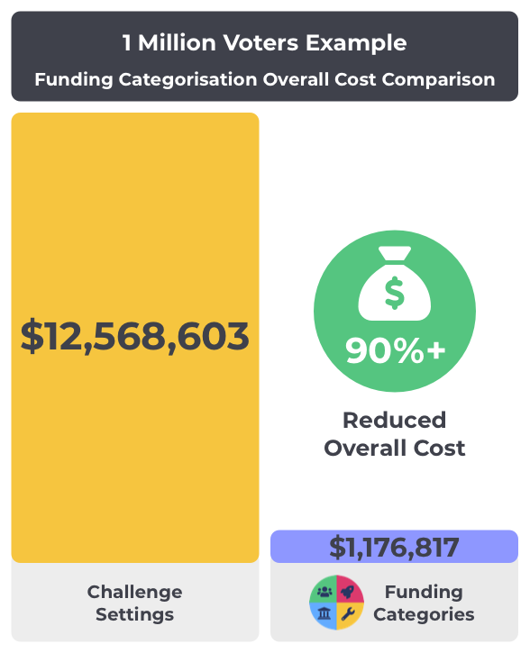
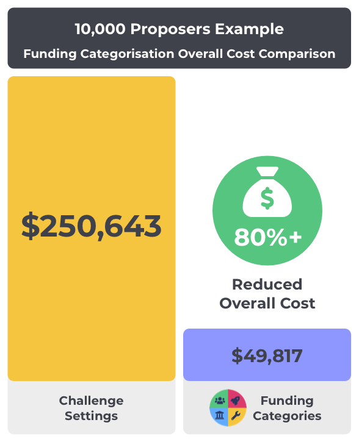

# Categorisation Overall Cost Comparison

The purpose of this comparison is to look at the differences between the overall costs of using challenge settings or using funding categories as different funding categorisation approaches. This analysis aims to help to highlight where the inefficiencies exist with either approach and which approach is better in terms of scaling in a cost efficient manner.


[methodology-and-data.md](methodology-and-data.md)


\
**Please note** - The following total cost comparisons are created from an aggregation of both accurate values and **estimates.** These are calculated using the [methodology defined](methodology-and-data.md) separately and the data sources that are available. To create your own estimates you can copy the data and make any adjustments as desired.

### Funding round overall cost comparisons

Overall cost comparisons for categorisation approaches in different funding rounds.

**Fund 9**&#x20;

<figure><figcaption></figcaption></figure>

****

**Fund 8**

<figure><figcaption></figcaption></figure>

****

**Fund 7**

<figure><figcaption></figcaption></figure>

****

**Fund 6**

<figure><figcaption></figcaption></figure>

****

### **Example scenario overall cost comparisons**

Scaled examples to show cost comparisons in different scenarios such as increased voter or proposer participation.

**1 million voters example**

<figure><figcaption></figcaption></figure>

**10,000 proposers example**

<figure><figcaption></figcaption></figure>

### Analysis

****

**Very high voter cost with challenge settings**

Challenge settings don't effectively scale for the voter as they must review a large number of categorisations to make a decision. Increasing effort requirements for voters to participate increases the total cost drastically for the voting process and decreases the likelihood of scalable participation. The voter is the highest population member involved in the voting process which means that tasks required for them to participate in the funding process need to be optimised to help increase their ability to fully participate.

**High proposer cost with challenge settings**

Scaling the number of proposers also has a significant enough impact on increasing the overall costs on the funding process. Proposers must read and understand a moderate percentage of the total categorisations available in each funding round. The number of categorisations used will be multiplied by an increasing number of proposers who must interpret and use them for submitting proposals. Reducing complexity here also helps make the process more scalable in terms of the time based costs that are involved.

**Funding categories removes many costs**

Funding categories removes costs around the creation, collaboration, moderation, assessment and assessment reviews. This is because funding categories are an inclusive and recurring form of categorisation. These savings help result in proposers, community advisors and voters having more time to spend in more meaningful areas of the process.

**Budget weighting automation improvements**

Funding categories can be further improved in terms of the voter cost by integrating data into the voting process to help make suggestions for the budget weightings. In the future this whole process could also be fully automated. This could be achieved by integrating community voted goals and objectives along with data from the usage of categorisations from previous funding rounds to create an algorithm that could eventually automate the budget weightings of funding categories. If the voting infrastructure is improved then another way this cost could be removed is if categorisations were removed and proposals went into a single categorisation. If desirable outcomes are achieved with this approach then this is a worthwhile future consideration to further drive simplicity. This same approach for automation with challenge settings is not practical due to these categorisations changing every funding round. This factor makes it hard to automatically analyse and automate the budget weightings for future rounds. If the requirement for voter participation on budget weighting can be removed in the future through automation this would be a massive cost saving that makes the process far more scalable.

**dRep considerations**

The high voter cost with challenge settings increases the probability that a voter will delegate their voting power to another individual due to the high cost of participation. This centralises power to fewer individuals and is something the process should look to minimise where possible. Most voters will have limited time to participate in every part of governance. The use of dReps is not a solution to problems with funding categorisation inefficiencies. Instead it is an alternative model for voting and would be a bandaid improvement on a bad funding categorisation system. The cost of handling complex funding categorisation would still make a dRep less efficient and effective at their role of voting on proposals due to the effort required for funding categorisation voting.
