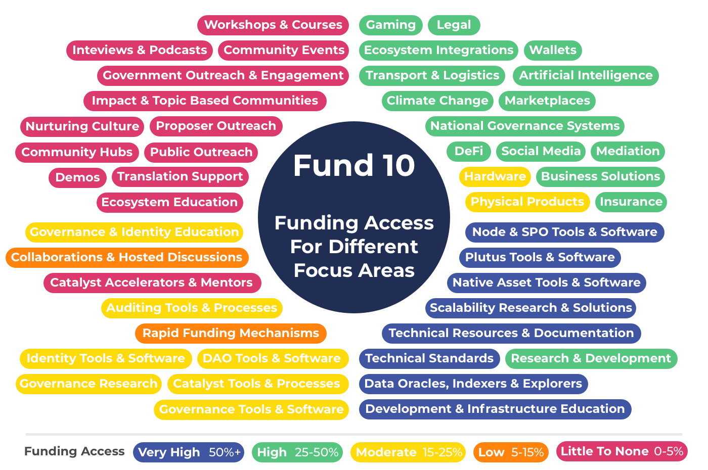
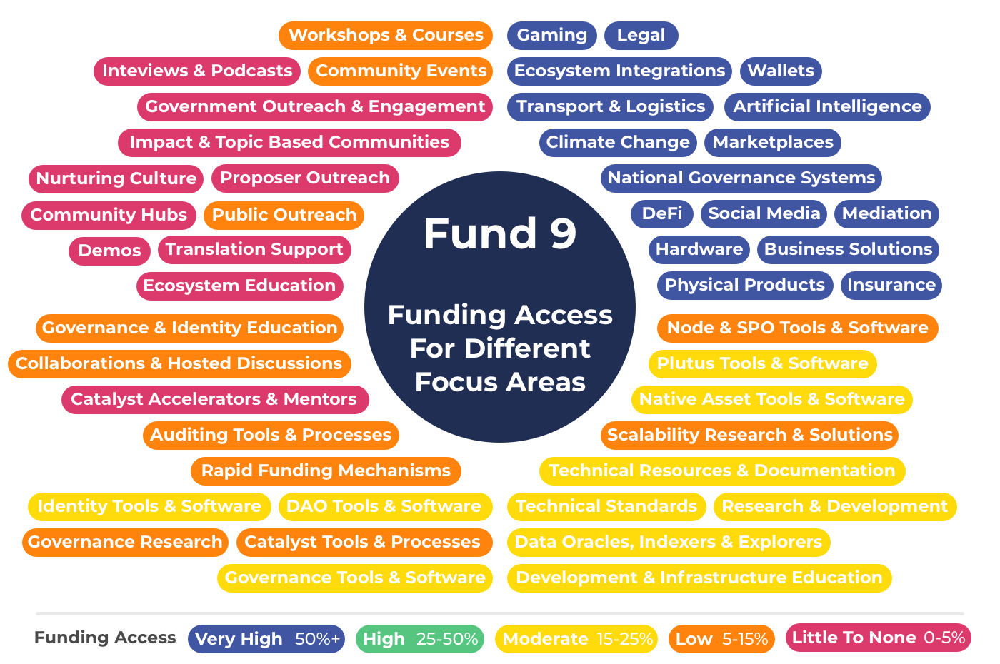
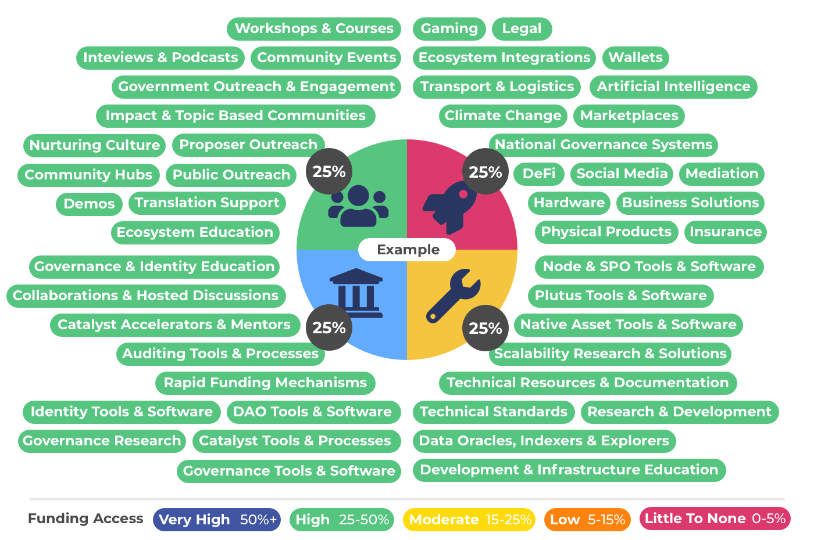
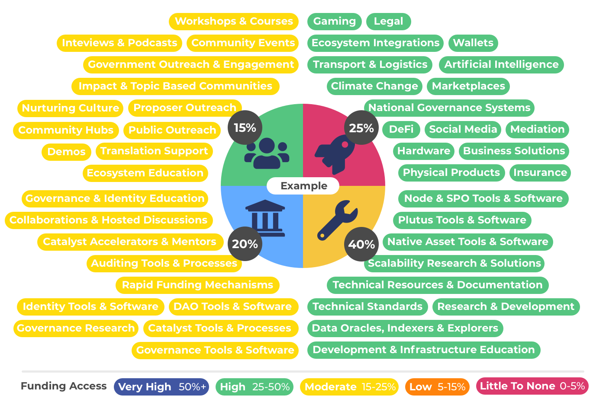

# Funding Access For Each Focus Area

To understand the implications of using certain funding categorisation approaches one useful visualisation is for seeing what amount of funding was available to each of the proposal focus areas in each funding round.


[methodology-data-and-feedback.md](methodology-data-and-feedback.md)


****

### Funding access per focus area each funding round

All of the following examples have a dedicated fund page that include observations on the categorisation for that funding round along with a comparison  with how a roughly equivalent categorisation outcome could have been achieved using funding categories.

****[**Fund 10**](fund-10.md)

<figure><figcaption></figcaption></figure>

****[**Fund 9**](fund-9.md)

<figure><figcaption></figcaption></figure>

****[**Fund 8**](fund-8.md)

<figure><figcaption></figcaption></figure>

****[**Fund 7**](fund-7.md)

<figure><figcaption></figcaption></figure>

### Funding categories examples

The usage of funding categories can achieve the same or better outcomes than the challenge setting approach but with far less complexity and also ensures that a wide range of proposals focus areas always have access to potential funding.

For the following examples we ignore Catalyst contributors and Cardano contributors as these are new funding models that aren't focussed on the normal proposal model. Just comparing proposal based categorisations make this a like for like comparison for the historical examples. Nurturing Ideas & Teams is also ignored as it accepts all forms of idea and innovation so is not important for this comparison.

**Equally balanced example**

This can be achieved by splitting funding access into four 25% allocations for the each of the main categories of community & outreach, products & integrations, governance & identity and development & infrastructure.

<figure><figcaption></figcaption></figure>

**Development & Infrastructure focussed**

What if the community thought the Development & Infrastructure categorisation of proposal focus areas needs more funding directed to that area as a priority and less on Community & Outreach and slightly less on Governance & Identity? To achieve this with funding categories the community would just need to vote on a higher percentage value for the Development & Infrastructure category and reduce the weighting in the other categories. For this example the community would only need to vote with four different values that add up to 100 to indicate the budget weighting preference. The aggregate of every voters budget weighting would determine the final weightings.

<figure><figcaption></figcaption></figure>

### Analysis

**Higher complexity from overlapping categorisations**

There are a number of examples where there are a mix of similar broad categorisations such as [Developer Ecosystem](https://app.ideascale.com/t/UM5UZBraj) and [Open Source Development Ecosystem](https://app.ideascale.com/t/UM5UZBqsx) and also specific categorisations such as [Gamers On - Chained](https://app.ideascale.com/t/UM5UZBqeS) which are a subset of broad categorisations such as [DApps and Integrations](https://app.ideascale.com/t/UM5UZBrBL). This makes the process more complex for proposers as they must determine where to put their proposal to maximise the chance of being funded. Assessors must determine whether proposals should or should not be in certain categorisations and voters in cases will need to look in numerous categorisations to compare similar proposal focus areas. One way of trying to resolve this complexity is to add rules and guidance as to how categorisations should be used in a number of events however this simply just adds extra unnecessary complexity.

**Difficult to easily determine what proposals should be included**

As the challenges are changing each round it became clear there is a constant complexity of working out which proposal focus areas can fit into which categorisations. It helps to highlight the importance of considering the trade offs of using recurring vs changing categorisation.

**Well defined categories make it easier to extract useful statistics**

The categorisations made it more difficult to create accurate percentages that would provide higher confidence as to what areas funding is being distributed towards. This again helped to highlight the benefits of using recurring categorisation. Using well defined categorisations would be effective in making it easier to see exactly what amount of funding is available for each proposal focus area. This allows the community to track over time to determine both what funding was available to different focus area of proposal and also what funded was actually distributed to each focus area. This data would be useful for further informing better budget weighting decisions.

**Current challenge setting approach requires a lot of interpretation**

To give an example of the interpretation that is needed one example could be that the "Cross collaboration" challenge states: "Number of events / workshops / sessions arranged with other communities" as a metric to measure. As hackathons are a form of event, proposers could interpret this as it being included in the categorisation. Another potential interpretation could be that educational resources could be included as well as they help facilitate similar outcomes as workshops. These examples are simple but important to highlight the added complexities of having changing categorisation where it leads to increased confusion when categorisations require more interpretation.
